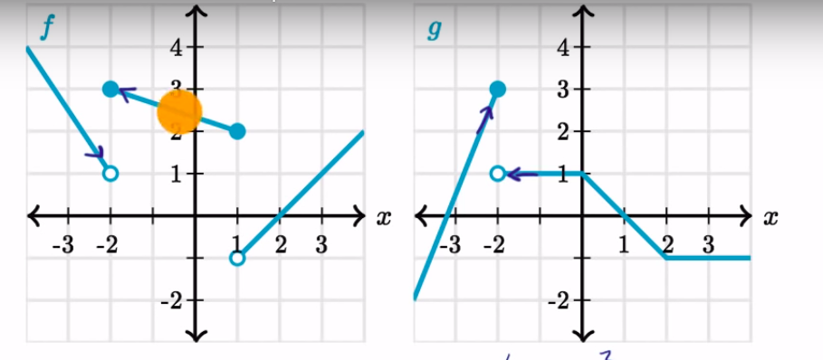

# Limit

Let `f(x)` = `x + 2`

The **value** of `f` when `x = 3` is 5.

There is a new concept called a **limit**. A function with all its inputs `i` defined has a limit. so `f(x)` would not have a limit, but `f(1)` would have a limit. 

The limit is the output value that `f` approaches as its inputs get closer and closer to `i`.

So the limit of `f(1)` is 3, since this is the value `f`'s output approaches as you stick numbers in it that are closer and closer to 1 (like 0.9999999, or 1.1111111). 

The notation for a limit is

    lim f(x) x -> 1 = 3 

We will formalize limit more later.

## Isn't this just the *value* of `f(1)` though? 

Well, not quite. In some cases the value that we approach as the input gets closer to some number isn't the same as the value when the input actually *is* that number.

Let's imagine a new function `p` which is defined as:

    p(x) {
        if x == 2: 100    
        else: x + 3
    }

Now, as the input of `p` approaches 2, what value is `p`'s output getting closer and closer to? The answer is 5. So that is the limit of `p(5)`

    lim p(x) x -> 5 = 5

But, of course `p(5)` itself is equal to 100. 

So there we go, limit and value are two different things. 

## more formally

Of course *closer and closer* is very wishy washy. Things are a little tricky because of infinitesimals, which mean that you can get infinitly close to any number without reaching it, but we can still manage some more formality.

What the expression

    lim f(x) x -> 1 = 3 

*actually* means is that: 

1. imagine a number `p` which is defined in terms of its distance form 5 `d`.
2. any such `p`, no matter how small it's `d`, can be generated by inputting some number very close to 1, into `f`  

in other words there is no number so close to 5 that we cannot generate it by finding a number `q` that is very close to 1 and inputting it unto `f`.

## approaching from both sides

consider this function

    f(x) {
        x > 4: x + 2
        x <= 4: x + 1
    }

Now consider

    lim f(x) x -> 4 = ???

What is the answer here?

As you approach 4 from "the right" (i.e. 4.1, 4.01, 4.001, ...), the output of `f` approaches 6. 

As you approach 4 from "the left" (i.e. 3.9, 3.999, ...), the output of `f` approaches 5. 

Which of those should we choose as the limit of `f(x) x -> 4`? The answer is neither. If a function with an input produces different outputs when approached from different sides, it is said to have no limit for that input. In this case 

    lim f(x) x -> 4 = NO LIMIT

## limits and infinity

Consider the graph `f(x) = 1/x^2`.

What is the limit of this graph as it approaches 0?

You might think that the limit is infinity, but another thing about limits is that they can only exist if the outputs of the function in question are approaching a specific number. 

In this case no specific number is being approached as `f`'s input gets closer and closer to 0, so `f(x)x -> 0` has no limit, or else we can say that the limit is **unbounded** meaning that it does not approach any specific number, but does seem to approach the same undefined value.

In cases where the output is approaching two clearly different unbounded numbers, you cannot say that the limit is unbounded. The fact that it is pointing in two different directions means that there is no limit.

## approaching from different sides

As well as an overall limit a graph with inputs defined can have limits from one or the other "side". Often, as in the case of functions like

    f(x) = x + 6

limits for most inputs will be exactly the same form both sides. 

Occasionally though, with some of the funkier graphs like

    p(x) {
        x > 4: x^2
        x <= 4: x -100
    }

limits will be different from both sides. For instance the limit "from the left" or smaller side for `q` as its input approaches 4 would be written  

    lim p(x) x -> 4^- = 16

The positive limit would be written

    lim p(x) x -> 4^+ = -96

There is no overall limit for `p(x) x -> 4` because the limits from either side do not match.

## Properly formal definition of limits

So far we have been defining a limit for some function `f(x)` generally, for some input `c` as `L`  where

    lim f(x) x -> c = L

But wouldn't it be nice to actually prove that statement with maths?

OK, so the real definition of a limit is:

The limit of `f(c) = L` iff

For every positive number `e`, there is some other positive number `d` such that, for all numbers `x` within `d` of `c` `f(x)` returns a number within `e` of `L`.

More mathsey:

    f(c) = L implies, 
        for each e > 0, 
            there exists some d > 0 such that 
                for each x where |x - c| < d
                    |f(x) - L | < e 

## Proving it

Of so now we have a formal maths definition, yay. We now are going to se this definition to prove a limit for a function.

The function we are choosing is `f(x) = 3x`. 

The input we're giving it is 3. 

We want to PROVE that 

    lim f(x) x -> 3 = 9

How do we do this? Well let's look at exactly what we're trying to prove:

    for each e < 0
        there exists some d < 0, such that
            for each x where |x - 3| < d
                |f(x) - 9| < e

Basically we do it by defining a function which takes in any positive `e` (by the above definition of e) and returns a `d` that fits the above parameters. If we can find a function that does that, we know that for each positive `e` there does indeed exist a `d` that meets the limit requirements.

### proof

1. we know that there is always some `e` such that `|f(x) - 9| < e` This is very basic mathematics, there is always some larger number.
2. if we also knew that for all such values of `x`,  `|x - 3| < e`, then we could easily make a function that returned a `d` for every `e`. It would look like this:

    f(x) = x

i.e. `e` itself would be an example of an acceptable `d`.

3. in this case though we can't be confident of `2.`, but maybe we can make the first function look a bit like the second function. let's apply some transformations:

    |f(x) - 9| < e
    |3x - 9| < e
    |3x/3 - 9/3| < e/3
    |x - 3| = e/3

OK, so now we have something at least *similar* looking. And in fact, we may have all that we need. Now we know that for every `e` such that `|f(x) - 9| < e`, there exists some number, `d` in this case `e/3` such that `|x - 3|d`. 

Okey dokey, so we worked out that for *this particular function* as long as `|f(x) - 9| < e`, we can always generate some number such that `|x - 3|d`, and this was all we needed to prove to establish that 

    lim f(x) x -> 3 = 9

## Limit properties:

Let's imagine we have two functions `f(x)` and `g(x)`. We can also imagine a third function `p(x)` which will always return `f(x)` + `g(x)`, just the sum of both results.

OK, so it turns out that 

    lim p(x) x -> c = (lim f(x) x -> c) + (lim g(x) x -> c)

I.e. the limit of `p(c)` is just the sum of the limits of `f(c)` and `g(c)`.

Same goes for subtraction

    lim (f(x) - g(x)) x -> c = (lim f(x) x -> c) - (lim g(x) x -> c)

And multiplication and division.

Similar with coefficients

    lim Kf(x) x -> c = K(lim f(x) x -> c)

## limits of combined functions

Lets imagine we have two functions `f(x)` and `g(x)`. We want to find the **combined limit**  of both these as `x` approaches `-2`. Imagine that these two functions are mapped as follows:

Neither of these functions themselves actually has a limit as `x` approaches `-2`, because approaching from the left and approaching from the right give different limits. With *combined* functions though, the combined function `c` will always have an overall limit so long as `c`'s limit approaching form the right is the same as `c`'s limit when approaching from the left, regardless of whether the functions that make up `c` have limits or not.

So in this case, if `c(x) = f(x) + g(x)`, then

    lim c(x) x -> -2^- = (lim f(x) x -> -2^-) + (lim g(x) x -> -2^-)

and 

    lim c(x) x -> -2^+ = (lim f(x) x -> -2^+) + (lim g(x) x -> -2^+)

if both these are the same, then that will be the limit of `c(x) x -> -2`.

### ok, let's math

    (lim f(x) x -> -2^-) = 1 (approx)
    (lim g(x) x -> -2^-) = 3

    so 

    (lim c(x) x -> -2^-) = 4

    (lim f(x) x -> -2^+) = 3 
    (lim g(x) x -> -2^+) = 1

    so 

    (lim c(x) x -> -2^+) = 4

Boom, `lim c(x) x -> -2 = 4)`

## Composite functions

These are functions which take the output of other functions as input. For example

    f(h(x))

`f` is a composite function.

Finding the limits of composite functions is quite straightforward:

    lim f(h(x)) x -> c = f( lim h(x) x -> c) 

# Limits and continuous function

A function `f` is **continuous** for a given input `a` if

    lim f(x) x -> a = f(a)

I.d. if the limit for that input is the same as the value for that input.

This is kind of nice because if we know a function is continuous *and defined for all real numbers*, we can easily work out the limit approaching any of its input by working out its value for that input. 

For functions, like say, `tan(x)`, where the outputs for some real numbers are not defined, exactly the same applies *so long as `x` is in the domain of* that function. When `x` is not in the domain of the function in question, the limit is undefined (just like the output itself).

note that for a function `f` to be continuous *overall* `f(c)` must `= lim f(x) x -> c` for *all* `c`.

## rationalizing

Rationalizing an expression means getting rid of any square roots in it.

## Making continuous functions

If you have a discontinuous function, you can often make a continuous function that maps it, and also has values for the discontinuous inputs. It's easier to find the limits of these new functions because 

    lim f(x) x -> a = f(a)

Holds for all of them.

Point is: for some discontinuous function `f(x)`, if you can find a continuous function `g(x)` such that for all `x` for which `f(x)` is defined, `g(x) = f(x)`, AND there is only one `a` where `f(x)` is undefined at, then 

    lim f(x) x -> a = lim g(x) x -> a = g(a)

So even if you get a `0/0` for a limit, it doesn't necessitate that there is no limit, you might still be able to find what the limit would be for that functuon `f(x)` by generating a new, continuous function `g(x)`. Often though, you need to do a bunch of fancy algebra to get frmo `f(x)` to `g(x)` though.

## Indeterminate form

This describes a function where at least one input gives the result `0/0`, i.e. the `f(x)` we were talking about earlier. 

If you find a function with indeterminate form, there are 3 strategies for generating a `g(x)` that might be able to use to generate a function to acquire a limit from:

### Factorization (most common):

Just fuck with the factors until you get something on the bottom that you can cancel out something on the top with. The resulting expression is a good candidate for a possible `g(x)` so try it out and see if you get a determinate output for the limit we're looking for.

### Conjugates

This is rationalization, getting rid of square roots. Usually you multiply both sides by

     denominator/denominator

So like

    (num/denom) * (denom/denom)

Keeping in mind that that second expression always = 1.

### Trig identities

This is exactly the same as factorization, but converting trig terms into each other.

### Approximation (last ditch effort)

Literally just plug in values close to the limit from both sides and try to estimate where things are heading.

## Squeeze theorem

This states that if you have three functions such that `f(x) >= h(x) >= g(x)`, and for some `k`, `f(x) = g(x)`, then `f(k) = h(k) = g(k)`. 

## types of discontinuity

A function `f(x)` is discontinuous if

1. **removable** `f` has a limit for all `x` but, the limit is not always the same as `f(x)`. This will look like a normal graph with a single dot removed.
2. **jump** for some `c`, `lim f (x) x -> c^- != lim f (x) x -> c^+`, i.e, at some point the limit from the right does not equal the limit from the left.
3. **Asemtotic** where for some `c`, `lim f(x) x -> c = unbounded`. This is those funny graphs where both sides disappear off up or down towards infinity.

## Continuity over an interval

So we know how to tell if a function is continuous for a value `c`, but how do we ever tell if a function is continuous overall? 

Basically we can rely on the semi-rigorous idea that a function `f` will be continuous over an interval (`a`, `b`) iff for every `c` such that `b > c > a`, `f(c) = lim f(x) x -> c`. 

This is only for the open (i.e. non-inclusive interval) though. for the closed interval (which, notation-wise, uses square brackets), we *also* have to satisfy the additional requirement that:

    lim f(x) x -> a^+ = f(a)

I.e. that the limit of `f(x)` as `x` approaches `a` from the right (larger) side is equal to `f(a)`. Only the smaller side though. The bigger side doesn't matter.

### defined-ness

One of the things that a function `f` *must* have in order to be continuous over an interval (`a`, `b`) is that it has to at least be *defined* for every possible input within that interval. Since, as soon as a single output within that interval is undefined, we're going to have at least some **removable** discontinuity. This is a handy shortcut for finding discontinuous functions.

## Infinite limits

Where a function has an asymptote, and both sides of the graph approach infinity in the same direction, at, say point `c`, we can say that 

    lim f(x) x -> c = infinity.

The same cannot be said of graphs that approach infinity in opposite directions.

## Limits where the input is infinite

Wherever a graph has a horizontal asymptote it means that as the x value gets larger and larger (or smaller and smaller) the y value approaches some number, no matter how high of a number you assign x, you can never get a y value of that number. 

In such cases we might talk about the limit of that function `f(x)` as `x` approaches infinity

    f(x) x -> infinite = some y value

This is perfectly valid notation. 

## Working out limits as x approaches infinity

Take the function 

    f(x) = (4x^5 + 70x^2 - 9) / (6x^5 - 100x^3 + 8x)

Let's imagine we were trying to find

    lim f(x) x -> Inf.

Now, this function looks pretty tricky, but lets think about what is going to happen as `x` becomes very very big. For the numerator, the expression `4x^5` is going to become much much more significant than any of the other expressions. Similarly in the denominator `6x^5` is going to become more and more significant compared to the others. 

We know that we're going to be dealing with incredibly large values for `x` because we're looking for what we're getting to as `x` approaches infinity, so if we're ok with an approximate value, we can reduce `f` down to

    f(x) = 4x^5 / 6x^5

Which cancels to

    4/6 = 2/3

So if we're ok to be approximate, it looks like we can say

    lim f(x) x -> inf = 2/3

Just a neat little trick there for ya. It's actually more widely applicable than you might think.

### Fast numerators and denominators

consider the function

    f(x) = (3x^3 - x7) / (x^4 + 7)

And again, assume we're trying to find the limit as `x` approaches infinity. 

Here, the numerator is growing faster than the denominator. That means if we just keep using larger and larger values for `x` the value for `y` is going to get closer and closer to `0`, so we can confidently say that

    f(x) x -> Inf. = 0

Similarly in a function like

    f(x) = (3x^9 - x7) / (x^4 + 7)

Where the denominator is growing faster, as we get larger and larger values for `x`, we're going to get closer and closer to infinity, (we'll be getting closer at a slower rate than, say `3x^9` by itself, but that's still definitely the direction we're headed in.

## Intermediate value theorem

This states that if you have a function `f(x)` such that `f` is continuous over the (closed) interval [`a`, `b`], then for every value `v` within the interval [`f(a)`, `f(b)`], there is `x` such that `f(x)= v`.

So for example, if 

    f(x) = x + 10

Then `f` is continuous over the interval [4, 10] (it's just a straight line). This means that it must be possible to generate every number between `f(4)` and `f(10)` (i.e. 14, and 20) by plugging some input `c` to `f`, where `4 >= c >= 10`. In other words every value between 14 and 20 can be generated by inputting some value `c` between 4 and 10 (inclusive) into `f`.
