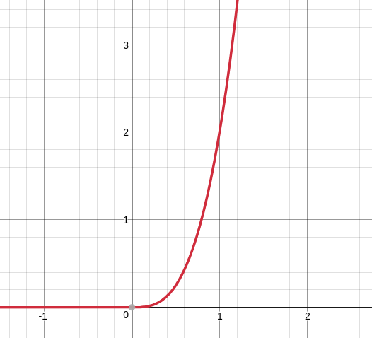
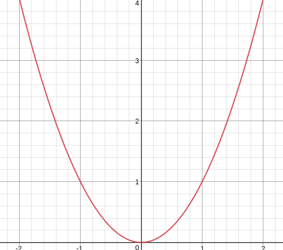
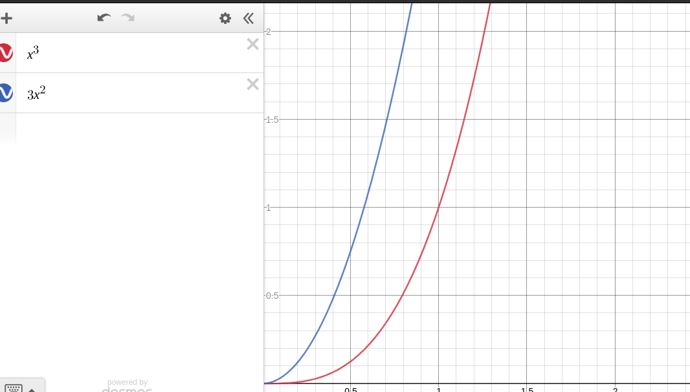
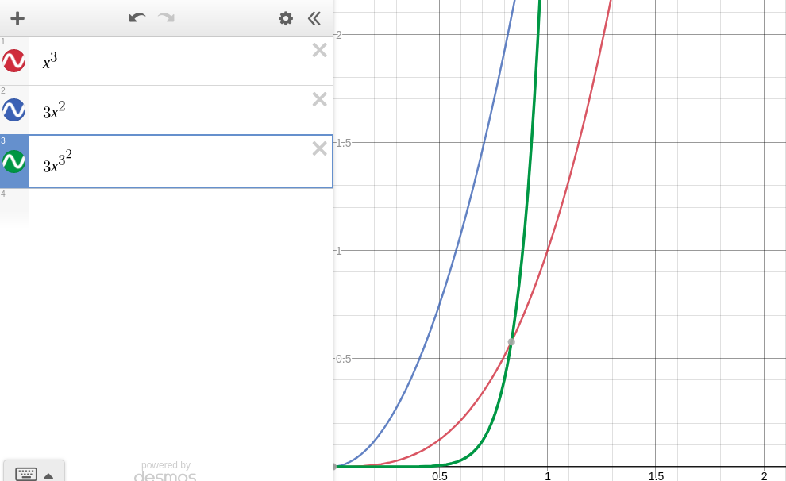

## Rate of change in y over change in x

Let's say we have a graph.

    f(x) = x^3 + |x^3|

We can easily measure the rate of change over the x axis compared to change over the y axis over a given spread of x values, by simply taking two x values, let's say 0 and 3, plugging these into `f` and comparing these to the corresponding y values

    f(0) = 0
    f(3) = 54

So over the period [0, 1] it looks like the rate of change is (rise over run) 
    
    (54 - 0)/(3 - 0) = 54/3 = 18

So that's the rate of change for that interval. It means that whenever `x` increases by 1, `y` increases by 4.

Note of course, that 18 does *NOT* represent the rate of change across the whole function. If we take the rate of change over the interval (0, 4), we get 32, double what we had before. If we take it over the interval (2, 4), we get

    (128 - 16) / (4 - 2) = 112 / 2 = 56

Which is different again, because in this case the rate of change across `f` is not constant.

The thing we're interested in in calculus though, is working out the rate of change *for a single point*.

## derivative

In mathematics the notation for the difference function, i.e. the function which takes two x values and spits out the rate of change between them as

    Dy/Dx

So for the function above we might say that

    f(x) = x^3 + |x^3|
    Dy/Dx over (0, 3) = (54 - 0)/(3 - 0) = 54/3 = 18

A cool thing to note is that the `Dy/Dx` of a function `f(x)` can itself be mapped for values of `X` and made into it's own function that can itself be graphed.

To do that though we'd need to find out what `D/Dx` is for a *SINGLE* value of `x` is, rather than a range. 

## Narrowing in

Maybe we could get the rate of change for a specific input `c` by getting lots of values very close to `c` like `c + 0.00000001`, and getting the rate of change between these and `c`? Unfortunately this won't work, because the real numbers are infinitesimal, so no matter how close we get to `c`, we're still only getting an interval close to `c`, over which the rate of change might be different to the rate of cgange at `c` itself.

## Limits

And now we get to learn why limits were so important, turns out that, for a given function `f(x)` you can get the rate of change at a given `x` by calculating

    lim Dy/Dx Dx -> 0

i.e. the limit of the difference function for `f(x)` (that is `Dy/Dx`), as `Dx`, i.e. the difference in the two `x` input values approach 0. 

In maths an instantaneous rate of change is called a **derivative** and its notation is `d/dx`. So you might say that

    lim Dy/Dx Dx -> 0 = d/dx

We can also notate a derivative of the function `f(x)` for a certain value `x1` as 

    f`(x1)

in which case

    lim Dy/Dx Dx -> 0 = f`(x1)

Lastly it is sometimes just denoted as

    y`

Which kind of makes sense, since `f(x)` = `y` so you can imagine the parallel between ``f`(x1)`` and ``y` ``

Just keep in mind that both exist.

## secant lines

When you calculate `Dy/Dx` you effectively find two points along the graph line for your function `f(x)`. The straight line that runs between (and beyond) these two points is called the **secant line**. The slope of a secant line is defined to be `Dy/Dx`

## tangent lines

If you know the `dy/dx` for a given point, and drew an infinite line outwards from that point in each direction at the slope of `dy/dx`, you'd get a tangent line.

The actual definition of a tangent line is a line that intersects the graph *only once*. Which is quite nice.

This being the case, you can work out the `dy/dx` for a given point `p`, if you know any two points along the tangent line for `p` (since these lines are always perfectly straight and so will have the same slopeiness everywhere)

## Mapping the derivative

We want to be able to calculate the rate of instantaneous change for any point in the function `f(x)`. In order to do this what we really need is a way of going from any `x` to the derivative of `x` (`dy/dx`, for the function `f` of course). 

Happily, there exists such a function. 

    d/dx f(x) = (f(x + h) - f(x)) / h

Which is to say, for a given value of x, the function that maps the average rate of change between that value of x,`x` and any other value of x, `x + h` is   

    (f(x + h) - f(x)) / h

So for instance if we want the derivative of `f(x)` where `x = 2`, we can start by mapping the graph of 

    (f(2 + h) - f(2)) / h

This new graph would take `h` as it's x axis value. 

### Concrete example

    f(x) = x^2

We want the `d/dx f(x)` at `x = 3`.

We start by mapping the following function:

    (f(3 + x) - f(3)) / x

Because we know what `f` is already, we can expand this to:

    g(x) = ((3 + x)^2 - 9) / x

This is a function we can just graph:

As above, the rate of change, `dy/dx` for a `f(x)` for a given `x` is equal to the limit of the function that maps the tangent line of `Dy/Dx` of `f(x)`, as `x` approaches 0. In this case, the tangent line mapping function is `g(x)` so `d/dx f(x)` when `x = 3` is

    lim g(x) x -> 0

As per [limits](./01-limits.md), we can try working this out first by assuming that `g(x)` is continuous, and trying to just find `g(x)` 

    g(0) = ((3 + 0)^2 - 9) / 0 = 0/0

But that didn't work, so instead we'll have to try some algebra to make a `g(x)`-like function that *is* continuous. 

    (3 + x)^2 - 9 = 9 + x^2 + 6x - 9 = x^2 + 6x 
    g(x) = (2^x + 6x) / x = x + 6 >>> where x != 0

Now we do have a continuous function, which maps onto `g(x)` in all places execpt where `x = 0` (it would seem at least) i.e. `x + 6`. Armed with this new function, we can find 

    lim g(x) x -> 0

simply by finding 

    0 + 6 = 6

So this is the famous `dy/dx`, instantaneous rate of change of `f(3)`: 6 (or like 6/1, `f(x)` is increasing by 6 y for every 6).

Of course, this doesn't hold for every point in `f(x)`, only `f(3)`. Let's work out `f(4)`, just for the fun of it to prove that the `dy/dx` is different.

The `Dy/Dx` of `f(4)` is:

    g(x) = (f(4 + x) + f(4)) / x = ((4 + x)^2 + 16) / x

Again `g(x)`, we'll get `dy/dx` if we find `g(0)`, but sadly this is undefined so we have to do some nonsense:

    ((4 + x)^2 + 16) / x = (16 + x^2 + 8x + 16) / x = (x * x + 8x) / x = x + 8 / 1 = x + 8

Now keep in mind that `x + 8` is *not* equivalent to `g(x)` because `g(x)` is not defined for `0` while `x + 8` is, but because we know that `x + 8` maps every defined input for `g(x)`, we can be confident that

    lim g(x) x -> c = c + 8

So

    lim g(0) x -> 0 = 0 + 8 = 8

Meaning that 8 is the rate of change, the `dy/dx` for `f(4)`. 

## Differentiability

We have our good old formal definition of the derivative of a point, but inevitably there are going to be some inputs for some functions for which there is no `dy/dx`. 

Generally we say that a function `f(x)` is **differentiable** for a point `c` if we can find the derivative of `f(c)`. 

And in general there's a fun fact that if `f(c)` is differentiable, `f(c)` is continuous. 

This fact does not run both ways. If `f(c)` is differentiable, there's still a chance that it's not continuous. 

But it does imply, of course that if `f(c)` is *not* continuous, then it cannot possibly be differentiable, (since that would invalidate our nice rule up there. Let's say `f(x)` is discontinuous where `x = 3`.

So `f(3)` must either be the location of a *removable* or *jump* discontinuity, or an *asymptotic* discontinuity. It seems pretty intuitive that you'd have a rough time finding a derivative for the asymptotic discontinuity, but what about the other two?

Well basically the `g(x)`, the `(f(3 + x) - f(3)) / x` isn't going to have a consistent limit as `x` approaches 0. The way the slope is pointing at `f(3.00001)` is going to be quite different from how it will slope at `f(2.99999)`, so `g(0)`, which represents the convergence of those two slopes cannot possibly have a defined value.

If `f(3)` is undefined, then of course there can be no `g(x)`, because the expression `f(3)` is contained in `g(x)` i.e. `(f(3 + x) - f(3)) / x`.

Generally finding the derivative of any point in a graph will not be possible where more than one tangent line intersects the corresponding point on the graph of that function. So sudden changes in direction are a bit of a red flag.

## Power rule

Here's a fun little shortcut

If

    f(x) = x^n

I.e. `f(x)` is the same as some power of `x`, then

    f`(x) = nx^n-1

That's just a nice, time saving rule.

## Chain rule

Let's say we have a composite function 

    f(x) =  f(g(y))

Now what we want to find out is the derivative of `f` with respect to `y`. That is, we know what `y` is, let's imagine that it's 8, and we want to work out what the rate of change of `f(g(8))` is. 

For this we can rely on the **chain rule** which states that

    d/dx[f(g(x))] = f`(g(x)) * g'(x)

So the derivative of the function `f` with respect to `x` is the derivative of `f(g(x))`, which could be thought of as like, the derivative of `f(y)`, multiplied by the derivative of `g(x)`. Put another way, the ratio of the rate of change between `x` and the output of `f` is: the ratio of the rate of change between `x` and `g(x)` *multiplied by* the ratio of the rate of change between `g(x)` (the output of the function itself, not its derivative) and `f(g(x))`.  

### Concrete example

let

    g(x) = x^2
    f(x) = g(x) + 3

All well and good. We want to work out

    d/dx[f(x)] = d/dx(f`(g(x)) * g`(x))

For say, the value 4. Ok, step 1, let's go and calculate 

    d/dx[g(4)]
    g`(x) = d/dx[g(x)] = (g(4 + x) + g(4)) / x = ((4 + x)^2 + 16) / x

We know that `((4 + x)^2 + 16) / x` is undefined for 0, so we're going to have to do some nonsense

    ((4 + x)^2 + 16) / x = (16 + x^2 + 6x + 16) / x = (x^2 + 6x) / x = x + 6

Ok, so now all we need to do is find ``g`(0)``

    dx/dy = g`(0) = 6

OK, great so now the derivative of our composite function is going to be

    d/dx[f(4)] = d/dx(f`(g(4)) * 6)

so now, on to 

    d/dx(f`(g(4))
    g(4) = 16
    f`(16) = (f(16 + x) - f(16)) / x = (19 + x - 19) / x = x/x = 1
     d/dx[f(4)] = (1 * 6) = 6

Ok, so that's our derivative of `x` with respect to `f(x)` where `x = 4`:

    f`(4) = 6

### Conceptualization

This makes sense conceptually. when trying to find ``f`(g(x))`` you're really looking for the ratio of the rate of change between `x` and `f(y)`. Put another way, how much will a change in `x` effect the value of `f(y)` (at a given point). 

Logically we can see that it makes sense to say that we work this out by first finding the ratio of the rate of change between `x` and `g(x)` (how much a change in `x` effects `g(x)`), and then work out how much a change in `g(x)` effects `f(g(x))`, and then multiply these two rates of change to get the full rate of change of ``f`(g(x))`` with respect to `x`.

### Visualization

This also makes sense visually, so consider the following two graphs:

Clearly these two have different rates of change, both point-for-point and in general. Now let's make a third graph which is the composite of these two

#### red x^3

    d/dx[x^3] = ()

# Partial derivatives

This is just the derivative of a function that takes two (or more) inputs, rather than one.

    f`(x, y)

In the end these are actually very similar to normal derivatives, just done twice. 

I.e. we work out ``f`(x)`` by asking "how much will an additional change in `x` effect the output of `f(x)` at some input `a`.

To work out ``f`(x, y)``, we ask two questions: 

1. how much will an additional change in `x` effect the output of `f(x, y)` for some input `(a, b)`
2. how much will an additional change in `y` effect the output of `f(x, y)` for some input `(a, b)`

So ultimately we end up calculating 2 different rates of change, the rate of change of `y` compared to `f(x, y)`, and the rate of change of `x` compared to `f(x, y)`. 

Another, final way of phrasing it is asking "how much do each of the inputs contribute to the rate at which `f(x, y)` is changing?

## New notation

The derivative of a partial function is not written as `dx/dx(1, 2)` as you might hope, but instead they have a funny symbol instead of the `d`. Because I cbs, I'm just going to use a `b`. They also express each rate of change seperately So for a partial function `f(x, y)`, that you wanted to know the derivative of at, say (2, 2), you'd end up calculating the derivative of `f(x, y)` with respect to `x`, which would be expressed `bf/bx(2,2)`, and then you'd need to calculate the derivative of `f(x, y)` with respect to `y`, which would be expressed `bf/by(2, 2)`.

## Working

And it turns out that working out partial derivatives is fucking easy as balls. let

    f(x, y) = x^2 * 2y^3

And we want `bf/bx(3, 4)`

Well we start by just converting `f` into a single-input function that just always assumes that `y = 4`, i.e.

    f(x) = x^2 * (2 * 4^3) = x^2 * 128

We then just work out the derivative for `f(3)`as usual

    f`(x) = (f(3 + x) - f(3)) / x = (((x + 3)^2 * 128) - 1152) / x

Then we need to do some algebra to find an equivalent function `g(x)` that is defined at `g(0)`

    (((x + 3)^2 * 128) - 1152) / x = ((x + 3)^2 - 9) / x = (x + 3 + 3)(x + 3 - 3) / x
    ((x + 6) * x)  / x = x + 6

And where `x = 0`

    g(0) = 6

Ok, so finally `bf/bx(3, 4) = 6` 

And now we work out `bf/by(3, 4)`

    f(y) = 3^2 * 2y^3 = 9 * 2y^3

Now we find the derivative function at `y = 4`

    g(x) = (f(4 + x) - f(4)) / x = (18 * (4 + x)^3 - 1152) / x

aaaaaand now we find a friendlier function `h(x)` that is just `g(x)` but is defined for `h(0)`

    h(x) = ((4 + x)^3 - 64) / x = ((4 + x)^3 - 4^3) / x = ((4 + x - 4)((4 + x)^2 + 4(4 + x) + 16))/x
    ((4 + x - 4)((4 + x)^2 + 4(4 + x) + 16))/x = x(4 + x)^2 + 4(4 + x) + 16)/x
    x(4 + x)^2 + 4(4 + x) + 16)/x = (4 + x)^2 + 4(4 + x) + 16) = h(x)

    h(0) = 4^2 + 4^2 + 16 = 48

So finally `bf/bx(3, 4) = 48`

As one would expect, the derivative of `f` with respect to `y` is far larger than the derivative of `f` with respect to `x`. This is because (as we can see intuitively) `f` is much more sensitive to changes in `y` than it is to changes in `x`.

### output

Just one more thing to note, the actual derivative of `f(x, y)` is considered to be a vector containing all the partial derivatives of the inputs of `f`

