# Recurrent NNs

Maybe try the train game

## Batch Normalization

This was a bit of a game changer it turns out, because it addresses the "vanishing gradient" issue, which prevented deeper models from training properly unless you put in some hack, like google did with those mid-point-gradient thingos.

ResNet actually gets around this issue as well without batch normalization, because, recall that addition gates pass the same gradient down to both sides, so the gradient coming into each residual module gets passed directly through it without being modified. 

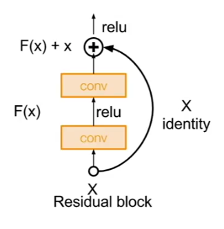

Dense-net and fractal net also help us manage gradient flow.

## Fun fact

the FC layers in alex net made up ~59m of the 62m parameters. SO, fc layers are bad. okey.

## Recurrent networks (RNN):

So far we've only looked at networks where there was a fixed input and a fixed output (i.e. input = image, output = class scores vector).

Recurrent networks can be used to generate networks that take inputs of varying length, such as any given english sentence, and derive outputs which are also of varying length.

By definition an RNN is a network which 

1. has an internal state
2. takes some input
3. updates the internal state based on the input
4. usually returns some value (probably a vector) as well

This can be expressed as a function, where `ht` is the internal state of the RNN at step `t`

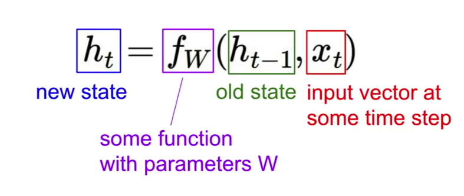

Note that `ht` is not the parameters of our RNN, these would be `w`. These are not updated at every step. The basic idea seems to be that the `h` is a kind of stored context within the network, so that it can make predictions based on what came before, rather than just what we have right now.

The output of such a RNN would be the result of `ht` at a given step, plus maybe some input from a some extra fully connected layers or something.

An example RNN might have:

1. A bunch of parameters `Wx` which you multiply against the input at each step
2. A bunch of parameters `Wh` which you multiply against the previous internal state at each step
3. A bunch of parameters `Wy` which you multiply against the current internal state to generate an output.

#### Note:

The `ht` is often the output of the network at a given step (sometimes we will record `ht`'s and use chain them together to form the actual output), but whether or not it is, `ht` as a hidden parameter is kind of like a way of keeping track, at each step, of the important features of the last step (and indeed many prior steps, since each `ht` is partly generated by the previous `ht`).

## Example

Here's another way of looking at RNNs:

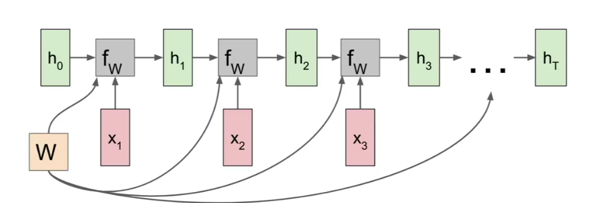

The hidden state would usually be initialized to all 0's.

Take note that the same `W` is used for each step. How would you compute the gradient for such a network?

The answer for a many-to-many (i.e. one output per step) RNN is: 

1. for each step you (probably) have some output `y`
2. For each `y` you can compute a loss (how far away was it from the ideal `y` for that step, usually using softmax )
3. For each loss you compute its gradient relative to the relevant `W`
4. Finally, you sum all the step gradients to get an overall gradient, which you would use to make an overall update to `W`

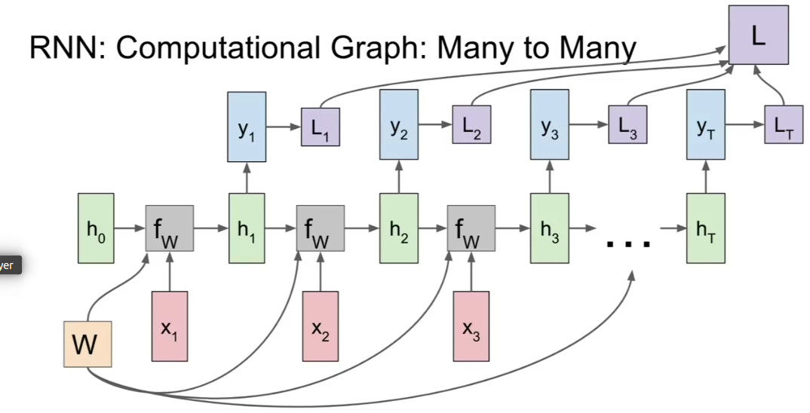

For a many-to-one RNN, you'd only end up with one output being generated by the final input and the final internal state (`h`), since by this point `h` should represent a kind of overall conclusion of the network. 

We would then just compute the gradient of this output to `W`, much easier.

For a one-to-many RNN (fixed-sized input, variably-sized output), you'd just take the one input, and then the `h` would keep updating on each step until some condition is met and then you'd spit out an output.

Finally, for a *sequence-to-sequence* RNN (e.g. translation, english sentence -> japanese sentence), you pretty much just do the many-to-one, and then take the output of that and do a one-to-many. 

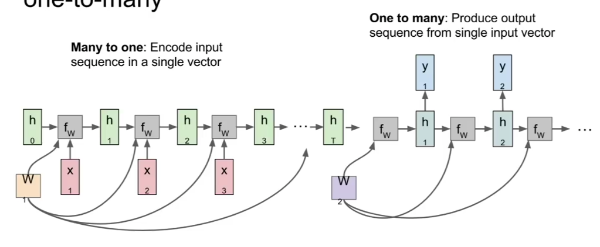

You have an *encoding* step, where you turn the variably-sized input into a single output (which would presumably represent the actual *meaning* taken from the english sentence), and then change that output into yet a further variably-sized output.

You'd compute the gradient here by summing the loss and computing a gradient form that sum to `W` (or, I suppose, each instance of `W` being used, and then summing all those gradients).

## Concrete Example

Imagine a network that is supposed to take strings of characters and return the likely next character. So for `hell`, you'd hope it would spit out `o`.

Let's say though that we're only training it for that one word.

So our vocabulary here is: [`h`, `e`, `l`, `o`]

And our training set is just the string `hello`

Our first task is working out how we're going to represent letters, lets say just a vector with one dimension for each element of our vocab (so a 4-d vector in this case), where the dimension corresponding to the actual letter is given a 1, and all other dimensions are given a 0.

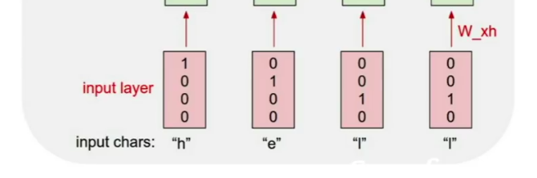

You then feed each letter into the RNN. The rnn, will then run each letter vector past our hidden state and do 2 things:

1. Generate a new hidden state
2. Generate an output vector representing it's prediction for what the next letter should be

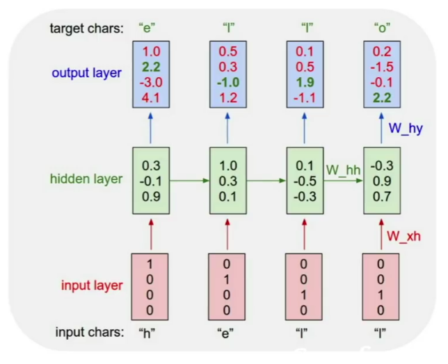

## Generating content

RNN's lend themselves to generating new content quite well, because all you have to do is feed them the first element of a sequence (say, the letter "h") and they will generate the next element, which you can then feed back and so on.

A clever thing you can do actually, is use the output vector, something like

    [2.3, -4.1, 0.6, 1.1]

to generate a probability distribution

    [0.87, 0.01, 0.1, 0.12]

And then "sample" i.e. randomly select a vocabulary element, with randomness weighted according to that probability distribution an element from that, and make it the new input.

This is nice because a bit of randomness is good. There are often a few "good enough" outputs (i.e. a number of captions that make sense for an image).

## Efficiency

Consider the following RNN's:

This is a depiction of an RNN whose per-step-updating weights are truly hidden. 

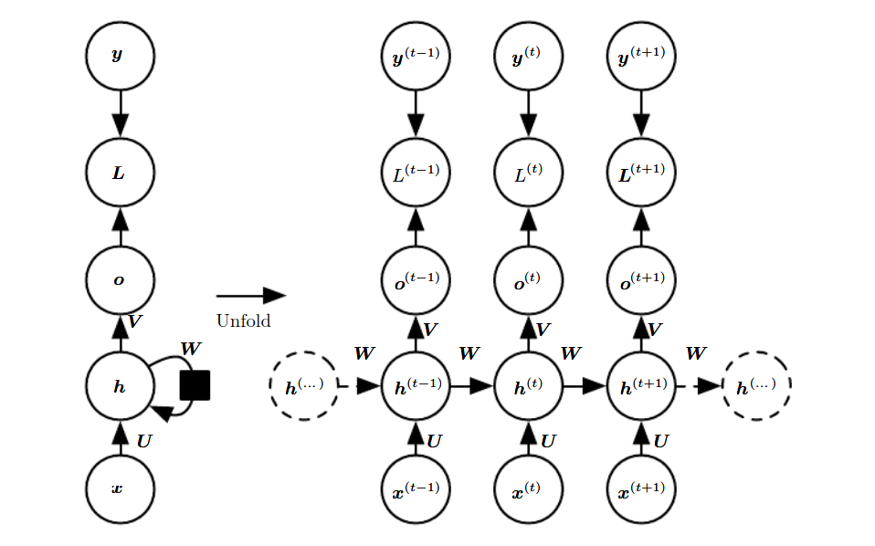

This RNN is different, it uses the outputs from each step as the "hidden" weight for the next step.

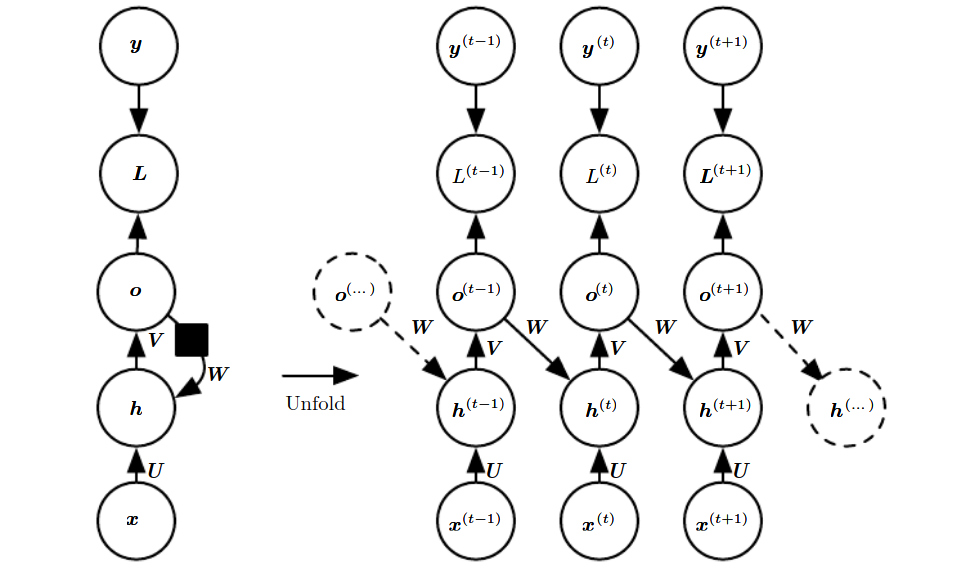

RNN's of the first variety are inherently not that efficient. This is because:

1. By definition you cannot compute each output until you are finished computing the previous one, so we can't take full advantage of concurrency.
2. For backpropagation you need to hold the `h` for every timestep in memory until you have computed all the gradients for that step.
3. Backpropogation must also be performed sequentially, since the gradient of each step has a relationship to the gradient of each subsequent step, so you cannot know the gradients of earlier steps until you have the gradients of later steps.

The second kind of RNN is less powerful. Ideally we want the "hidden" values to be tracking the state of the sequence up till now. It seems intuitively that it would be hard to do this whilst also giving correct class scores (or indeed, optimally correct class scores) or output or whatever. 

On the other hand, backpropogation is easier in the second network. The first nice thing is you don't need to hold the extra hidden parameter (as well as the output) on each step, which cuts down on memory usage a bit. Moreover, you can now compute an accurate loss for each step independently. Beforehand it was important to know what the incoming gradient for the hidden layer was. Now however, because the layer is no longer really "hidden", we can compute an accurate gradient for it just using the local loss (which we already know). A more perfect gradient calculation might take into account the incoming gradient for the "hidden" output from the next step, but the point is even without considering this we get a decent gradient. 

So now we can perform backpropogation concurrently for all steps.

### Teacher Forcing

This is the logical extension of using the outputs in place of hidden values, the idea is that rather than the actual outputs themselves, which are often incorrect (especially early in training), we just feed each step the *actual correct output* which we know already because it's train time.

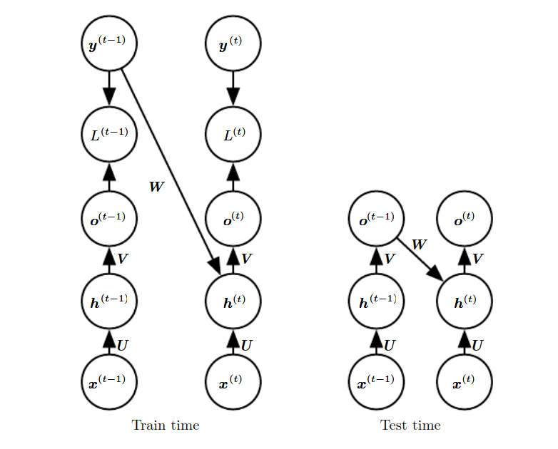

At test time we feed the outputs in again since now we might not even have labels (and using them seems a bit like cheating).

## Backpropogation 

The idea, as above is

1. go through entire sequence (1 step per element)
2. computer loss at each step
3. go back through entire sequence, compute gradient of current loss to `W`

This can be super slow though, if your sequence is massive, like the whole text of wikipedia for instance. That's a lot of elements.

So we often use **truncated backpropagation through time**, by which we only perform like 100 (or whatever) steps before calculating the gradients and performing and update. You persist the hidden state for the next 100 steps you perform after the update.

This is equivalent, roughly, to minibatches. 

### NOTE:

The hardest part of this (at least for you, Louka), seems to be nodes whose output is of a different dimension to its input. The golden fucking rule here is that the dimensions of the gradient of an input of a node with respect to the nodes output must be *exactly* the same as those of the input in question. 

So when constructing the graph it can be a good idea to keep track of the dimensions of all the input nodes as you are going along so you don't forget to convert the incoming gradients to the correct dimensions on the way backward. Then on the backwards pass, just convert the incoming gradients to the correct shape:

For instance, if the input has more dimensions than the output, you have to expand the gradient coming back:

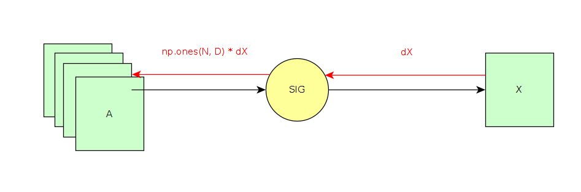

And if the input has less dimensions than the output, you'll have to sum the incoming gradient along the dimension that the input doesn't have:

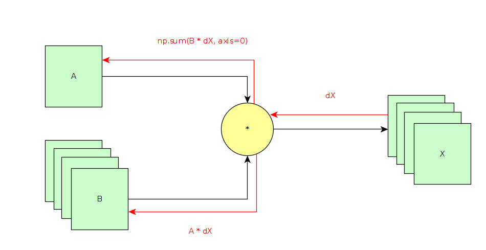

Re this last: a nice rule to remember is the **Multivariable chain rule** which states that if a variable is used > once in a function, the gradient of the function's output with respect to that variable will be the sum of all the individual gradients of each time the variable is used. So when the input is smaller than the output, this usually means that each variable of the input was used more than once in the node to generate that larger output (and when we reduce the incoming gradient we're actually applying the multivariable chain rule).

## Under the hood

So what they did was train a RNN on some text data.

They then picked a single scalar value `v` from it's `h` and recorded the value of `v` throughout testing (so like, how activated was it exactly from input to input)

They did this with a bunch of scalar values. Some of them seemed to have no interpretable pattern. Others did though. The following is an activation map of one of the values over this string of text (blue = higher)

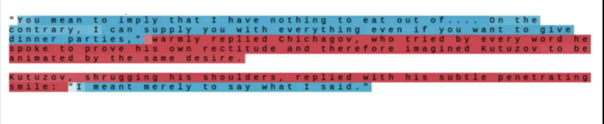

This `v` seemed to be activating on characters that were inside quotes (omg).

Keep in mind lol that this RNN only ever tried to predict the next character.

Some also tracked when we reach the end of a line, or whether we are in a comment or if statement for code.

## Image Captioning

Input is an image, output is a caption. Good for RNN, because we have a variable-length output. 

The strat is:

1. use CNN to make a vector summary of the image
2. use (one-to-many) RNN to take that summary and convert it into a sequence of characters (one character at a time).

How exactly we integrate the image information (which is usually like a 4096-d vector) is up to us, but a simple way is simply to add it as a third, non-updating weight at each step.

In such a case, the initial input for the caption-generating model is just a "start" token, of no real semantic value.

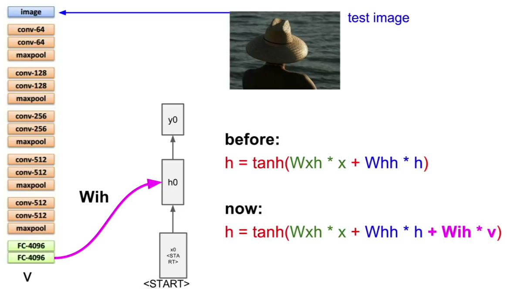

So you generate your first output vector convert it to a probability distribution and sample a vocab element from it (vocab is probably words), the `h` updates, and you feed the output back in as the next input. Part of your vocab would be an "end" input, which would cause the RNN to cease. 

## Attention

This is the idea that (with images) as well as a vector of vocab scores, you also produce a vector of image location scores, which will act as an additional input for each step. These image location scores represent which parts of the image we want our RNN to "pay attention to" in the next step.

So, to be clear, the input for each step is (1) the previous step's word and (2) the previous step's attention distribution.

These models tend to learn on their own to focus on the important parts of an image.

You can also use attention for image recognition.

## Multilayer RNNs

Recall that deeper layers generally mean better outputs, so it should come as no surprise that people are having success with 3 or 4 layers of `h` values that update each time rather than one. 

Generally not many more hidden layers than this though.

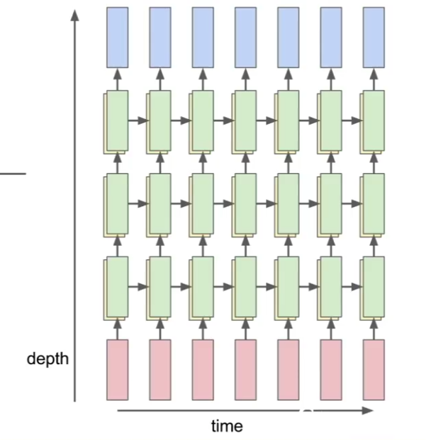

## Computing gradients

Here's an issue: let's say we took 100 steps, and we want to find the gradient of `h0` with respect to the overall loss `L`. 

To do this we are going to have to compute the gradient `g100` of `L` with respect to `h100`, and then slide back through every single cell, computing the gradient of `g100` with respect to `h99` (using the chain rule) and so on.

Keep in mind that `W` stays constant throughout this, so each time we calculate the gradient of the previous `hn` we're going to be modifying that gradient by exactly the same values each time. Let's imagine `W` was just the scalar 6, you'd be (let's say) multiplying by 6 at each gradient computing step, meaning that by the time we reach `h0`, the gradient is going to be huge (same with numbers smaller than 1 and tiny gradients). Naturally the same holds of vector `W`'s as well.

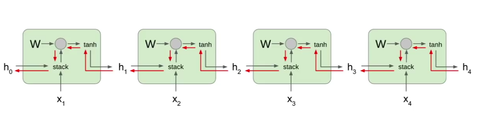

This is called the **exploding gradient problem** or **vanishing gradient problem**.

One way to solve this that actually gets used in practice is to work out the gradient, and if it is too large by some degree, just manually make it smaller. This is called **gradient clipping**.

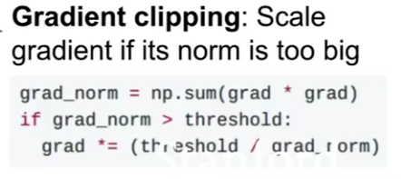

Vanishing gradient is a bit harder to deal with. Ultimately it is often best to avoid multiplying by `W` alltogether.

### Long short term memory

Rather than the **vanilla RNN**:

We use a **long short term memory store**, which keeps a *second*, even more hidden state `ct`, which updates on each step, and is used to generate the hidden, but still less hidden `ht`

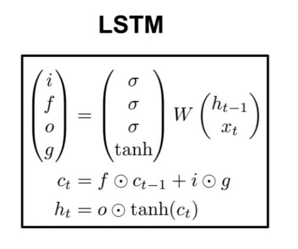

So, like the vanilla version, you take the input `x`, plus the previous `ht-1` and the weights `W`. From this you get your vector `v`, that you got last time, yay.

Next you use `v` to compute 4 values (so I think you have to set your `W` out so that it has 4 "chunks", each corresponding to one of these gates, almost like 4 matrices), all of exactly the same dimensions as `h-1`. These are computed by passing `v` into 3 sigmoids and a tanh. The names of these values are (don't worry about what they mean yet): 

    i -> input gate (sigmoid): 
    o -> output gate (sigmoid):
    f -> forget gate (sigmoid):
    g -> gate gate (no good name) (tanh):

We then calculate the super hidden `ct` value of the cell with

    ct = f . (c(t - 1)) + i . g

And finally we calculate the normal hidden `ht` value with:

    ht = o . tanh(ct)

In this context we can interpret the values of these gates a little:

`f`, the forget gate will be 0 > a value > 1, and we multiply it element-wise against the previous `ct`, so what we're really doing is calculating how much of the previous `ct` to use.

`i`, also a sigmoid the input gate represents how much attention we want to pay to the input and weights, recalling that all 4 gates are generated form these.

`g` sort of seems to represent the actual values of the inputs and weights being the only tanh that is derived from these.

and lastly `o` represents how much we want to even bother with the super hidden `ct` at all.

Remember that the `ht` will now be used to generate actual outputs.

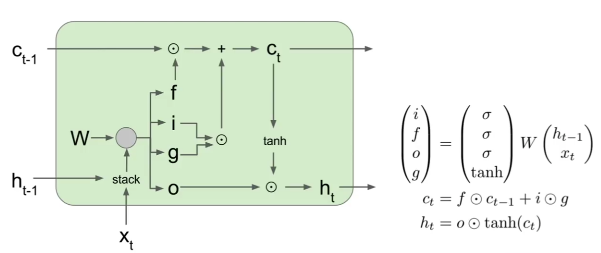

A bunch of guys tried tweaking LSTM a lot to see if it helped and they found that more or less all tweaks bring more or less the same results as the vanilla lstm setup. Google also did a huge automated version of this and got more or less the same results.

#### lstm gradients

Backprop is much nicer now (which was the whole point). This time the gradient of the `c` value is modifier by `f` at each step, but:

1. It is element-wise, so even if `f` was the same each time, the gradient of each element of `c` is getting an independent update.

2. `f` is likely not exactly the same each time because `f` comes form `W` plus the input, so it's a bit nicer and might have not so big of an impact. (in fact on initialization you often make `f` very close to 1)

3. `f` is a sigmoid, which means it can never be greater than 1.

So ultimately the `c` gradient kind of remains untouched throughout the backprop process, leading to a similar nice thing to what we had with RES-NET, where we can compute early `W`'s gradients using (in this case only partly, since in lstm you also need `h` to calculate the gradient of `w`) a `c` whose gradient is very similar to what it was at the very end.

### Highway networks

These are similar, and actually older than RES-NET's

### GRU

Similar to lstm, used to avoid vanishing gradients.