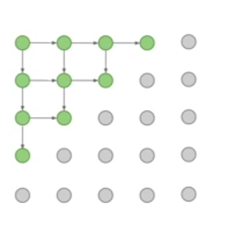
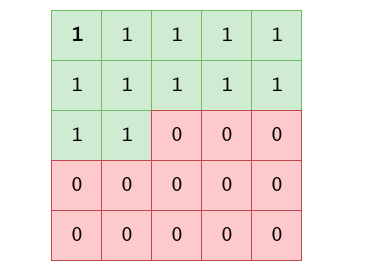
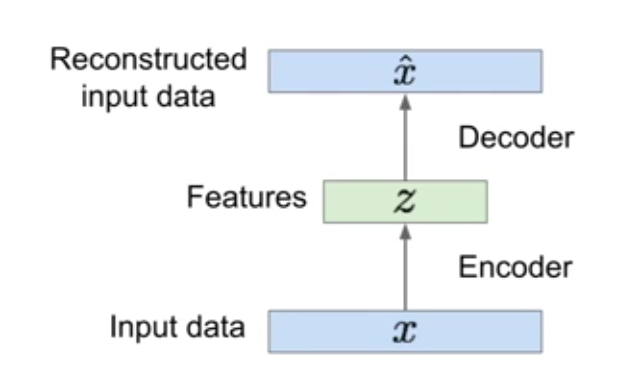
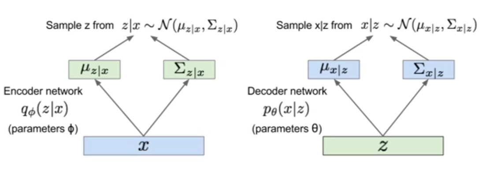
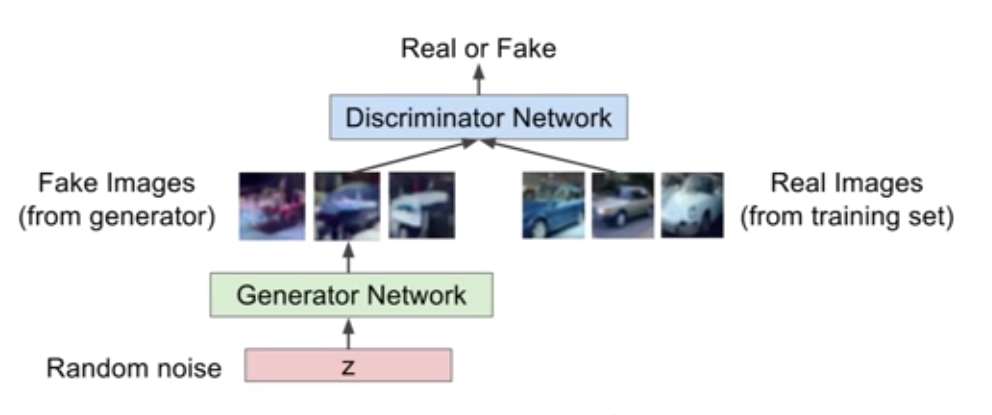

# Supervised learning

You have your data, X and your labels y, and the goal is to create a function that takes X and outputs y. 

# Unsupervised learning

There are no labels. You just have heaps of data. All you want to do is learn some sort of structure in the data. For example, you might want to learn the "**dimensionality** of the data: along what axis does the data vary the most? Or **density estimation** where we try to work out the distribution underlying the data (i.e. the datapoints are just points. We try to draw lines or 3d landscapes from them that represent the structure of whatever it is we are looking at (including data we didn't even collect)). 

## Why unsupvervised learning is good:

1. It's cheap. Doesn't need labels, just data.

2. Unsolved by comparison, kind of new.

3. Looks like its going to be useful af.

## Generative Unsupervised learning

?????

## Types of Generative unsupvervised models

### Pixel RNN's

in **Pixel RNN's** our goal is to take a given input X (like an image) and estimate the probability `p` of X. We work out this probability on a per-pixel basis, where the probability of a given pixel `xi` is dependent on all previous pixels (so like, lots of blue pixels probably make the probability of red pixels lower). And the probability of a given `X` is just the product of all the probabilities of each pixel.

Having defined the probability of each input like this, we can then generate the maximally probable input for a given set of inputs.

#### Obvious question: how do we order the pixels?

Like what's the "first" pixel for this process, what's second, etc? The answer seems to be this:

#### How do neural networks come into it?

So the idea  is you have your first pixel, and we need to generate two pixels from it. To do this we can just use a **Recurrent Neural Network** of one-to-many, takes one input, gives two outputs, all of the same size. In fact the most used one is a **LSTM** network (which is very hard to understand :( ).

One issue here is that this is quite slow (has to be done sequentially, so iteratively, which is always slower than concurrently).

#### Pixel-CNN

Same as above, we use a Conv NN rathern than a recurrent neural network. The idea is as follows: to predict a new image, you take an image and convolve a filter around that image as normal, such that the output image has the same dimensions as the input image (so like, no stride pls). 

BUT, 2 things:

1. You score the output image on how close it is to the input image. The distance is the loss.
2. If you just did this it would encourage the network to make all it's filters all 0's but for the central pixel, since this is the exact output we want for that pixel. To prevent this we completely zero out the central pixel on each filter, and all the proceeding pixels. 

SO now each filter output becomes a kind of "prediction" for what the central pixel will be according to the preceding pixels. 

This is nice because at train time you can just pass in all your test images and create output images concurrently by convolving like a normal CNN. This makes training pixel cnns much faster.

At test time though you don't have the image pre-made so you have to generate each pixel one at a time still.

### Variational Autoencoders

Because the previous two are so slow at generation, we want to try to find a different formula for calculating the probability of a given pixel (rather than relying on all previous pixels).

#### Regular autoencoders

An Autoencoder is just a function from an input to a lower dimensional feature map. This function can be anything, like maybe a deep cnn. The reason the output is smaller is that we want to learn features, and there probably isn't a feature for each pixel lol.

A feature map , from an image X would be considered "good" if you can take m, pass it through a decoder (probably another CNN, same as whatever the encoder was) and get Xi, which is of the same dimensions as X and looks a lot like X.

Generally similarity of the input and output is measured using l2 loss. You then make updates to the encoder and decoder according to gradient descent.

Note: no labels used here at all (woo).

Once training is finished, you can turf the decoder. 

Often what happens is you'll put a classifier on top of the feature map, train it using labels now, and ultimately turn each feature map into class scores. Hopefully this can now be used to label images.

#### Variational Autoencoders: use auto-encoders to generate new images

Theres some complicated probability mathematics which means certain things are not computable. So for some reason, when actually generating new images, rather than just generating a probability mapping z given an image X, we actually generate the mean, and covariance of z given an image X, and then we sample from these go finally generate a sampled z, which should be fully gaussian. 

We then generate or "decode" a new image Xi from z, we also use a similar process, generating the mean and covariance of Xi given z, and sampling from this to get the actual output Xi

Encoder can also be called **inference** or **recognition** network. Decoder can be called a **generation** network.

A fun additional thing is that it's actually generally kind of nice to know the probabilities of given features for sets of images.

## GANs: Generative adversarial network

What we want: to sample form a very complex, high-dimensional distribution (e.g. the distribution of all images 32x32x3).

There is no trivial way to do this, because (i suppose) we don't know what the complexity is exactly, and it would be hard to calculate given the huge number of dimensions.

Possible soloution: sample from a simple distribution (i.e. the random distribution of all images 32x32x3) and then learn a function that takes these samples and outputs something that looks like it belongs to the origional distribution.

The function from simple to complex distributions is going to be an NN. How how to train?

### Training method: 2 player game

You create two networks, the **generator** and the **discriminator**. The goal of the generator is to create outputs form the simple distribution that the discriminator thinks are part of the complex distribution. The discriminator's goal is to correctly discriminate between generated and real outputs.

The actual formualtion will be a **minimax** function.

Generally we will train these in alternation.

One thing to notice is that the vanilla minmax function is not so good for gradient descent on out generator, since (because of the log) good (fooling) scores will generate a steep gradient, and bad scores will generate a very shallow gradient. This means progress will be very slow until we are already doing well, which is kind of the opposite of what we want.

SOOOO instead we define the inverse of the origional function. Rather than "minimize the probability of the discriminator being correct" we want to "maximize the probability of the discriminator being wrong". This has an inverse gradient distribution, so yay.

### The actual concrete steps:

1. Train discriminator
    1. sample a minibatch from the random distribution (random prior)
    2. sample a minibatch from the complex distribution
    3. Pass all of these through the discriminator function, updating its weights using stochastic gradient descent on a loss function that rises as inputs are misclassified
2. Train generator
    1. sample a minibatch from the random distribution
    2. run all the inputs through the generator to get generated outputs
    3. run all the outputs through the (frozen) discriminator
    4. update the generator using stochastic gradient ascent on a loss function that rises as inputs are classified as real

Not sure how many steps of descriminator update for each generator update, active area  of research. Recent work has helped this.

Finally we'll probably just throw away the discriminator.

### Improvements

CNNs are sometimes used more recently, 2017 was a big year.

Active area of research. Wasserstein GAN is good.

### Extra fun

So with this generator the random noise you pick at the beginning will have a very large impact on what ends up being generated. In addition smooth changes in the random noise tend to create smooth changes in the generated images. You can also even isolate portions of the random noise that seem to correspond to certain points in the image. So for instance, you can take a huge number of noise samples that generated images of men with glasses, and a huge number of noise samples that generated images of men without glasses, and subtract the means of both of these to get a kind of "glasses" sample. 

When you add this "glasses" sample to random samples that generate non-glasses people, you can generally get generated images of the same people, but wearing glasses. 

#### Check out: "the GAN zoo"

