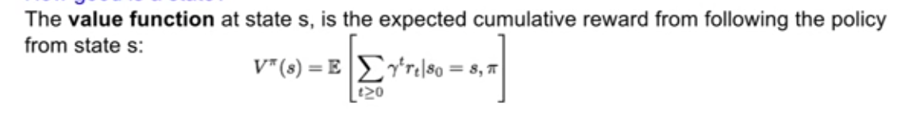
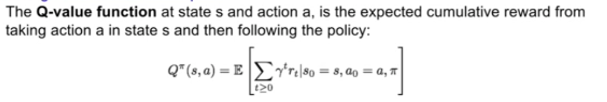

# Reinforcement learning

You have two entities:

1. **Environment**
2. **Agent**

The environment has the ability to generate **states**, and can take an **action** as an input and return a **reward**.

The Agent just takes a **state** as input, and returns an **action**. 

So the whole process goes:

1. env generates state, passes it to agent
2. agent takes state, generates action, passes it to state
3. state takes state, generates reward, passes it to agent
4. back to 1 

Eventually the environment generates a **terminal state** which will end the **episode** of training.

Computer games are a good example of things that can be used for RL. The state in this case is the raw pixels of the game, and the actions are your game controls.

## Mathematical formalization

We call the mathematical formulation of the RL problem the **markov decision process**. This formulation satisfies the **markov property**, which is "the current state completely characterizes the state of the world". Whatever that means.

the MDP is defined in terms of the following variables:

1. S: set of all possible states
2. A: set of all possible actions
3. R: A function that maps from a given state/action pair to a reward value
4. P: A function that maps from a given state/action pair to the next state
5. Gamma:"discount factor", that can weight sooner rewards more than later rewards

The objective of all of this is to find the best policy `pie`, that takes a state and returns a reward, such that the sum of all rewards (modified by gamma) is the greatest at the end of the process.

The **value function** is a function that takes a state and returns the *expected* (so like follow all the probabilities of coming states given P and R and so fourth.) final reward score from that state, given the current `pie`

This can be thought of as a measure of "*how good is the current function*"

The **Q-function**, this is exactly the same but takes an action-state pair instead of just a state. 

### The **Bellman Equation**

Take Q*(s, a) to be the equation that takes a state-action-pair and returns the maximum possible (expected) final reward resulting from that. So that is, assuming that your current state-action-pair is s and a, if you ran the rest of the episode like a billion times and played optimally each time, what is the ultimate reward tha you would get?

The answer is Q*(s, a).

The idea is that the optimal `pie` for any given s, will always be the one that selects whatever a maximizes Q*(si+1, ai+1) * gamma + r, i.e. Q*of the next state/action pair, times gamma, plus the reward of the current action. Put another way the best policy is the one that selects the action whose reward, plus the expected rewards for optimal play on all proceeding steps, is the greatest.s

I don't know exactly where bell

### How to find this best policy

The intuition is just like, take all functions Qi from action-state-pairs to final rewards, and keep throwing out Qi's that don't get the maximal final reward. The issue of course is that there are probably too many Qi's for this to be effective. Besides, to check the performance of each one you'd need to calculate Qi(s, a) for every possible s, a combination. Which can be a very large number.

A good soloution: just slap in a NN.

I.e. we just use a function approximator, which takes Q(s, a, u), where u is a set of parameters, and tries, by jiggling those parameters, to approximate this holy grail Q.

When this function approximator is a deep NN, we call the whole training process **deep Q-learning**.

### Actual implimentation

So we can just define a loss function as the distance between the earned reward by our Qi for our u, and the **bellman** maximum possible reward.

Then we can use gradient descent, as usual, from this loss to u. And update the gradient.

### Example: Atari Games

The bellman score would be like, the maximum possible score I guess.

### Issues:

The most basic approach is just to get the computer to start playing the game, and making decisions and rewarding as we proceed. This is not so good though. Remember, what we ideally want in training are *random states*, so that the weights learned by our NN are as general as possible. If the states we are using to train have some kind of bias, the weights we learn will probably be biased as well. With this in mind there are a few issues with this basic approach.

1. ????

2. If our model is playing space invaders, say, and learns to move towards the right, all future states will be biased towards the right, so this will cause it to learn biased rules that only work best in states where we're sitting near the right (when the actual optimal actions might lie in the middle and we're never going to learn them).

The soloution is **Experience Replay**, where we remember a table of the transitions (i.e. from state 1 action 1 to state 2, etc). Once we have a large enough table of these, we can just feed our network random states, and judge it's performance against the optimal performance. 

So for instance, we might have found the bellman maximizing action for a state W. We can than just feed W to our Qi and see how close the action it picks is to the optimal one, and then move on to another random W and so on.

### The actual process:

basically you:

1. Play the game a bit
2. Store the transitions you generated
3. Train your network against some random transitions
4. go back to 1

### Further Problems

The idea with Q-learning is that you have to learn the values of many state-action pairs, preferably all of them. Needless to say, this can get very impossible very quickly as the state space increases.

There is an approach that tries to fix this.

### Policy gradients

So let's start by defining P, a set of policies (pi... pn), which each take a set of parameters f, where f is a matrix.

Each p has a value, j(f), is the expected sum of all future rewards of that policy (all familiar stuff).

The goal under the **Policy Gradients** approach is to find the p in P, whose j(f) is the highest. We can call this policy f*

    f* = arg max j(f)

A straightforward way of approximating f* is through *gradient ascent*, towards the highest possible j(f).

#### More Concretely

A **trajectory** is a sequential record of all states, actions and rewards for an **episode** of reinforcement learning. An example might be collected over a single game of space invaders.

We can generate trajectories just by simulating events.

We can also calculate the overall reward for a trajectory just by summing up all of its rewards.

Finally then we can define the value of a given p by taking all the trajectories that are possible according to p, and calculating an *expected value* (i.e. the expected trajectory) by sampling from these. The value of p is the expected value of like the most probable trajectory given p.