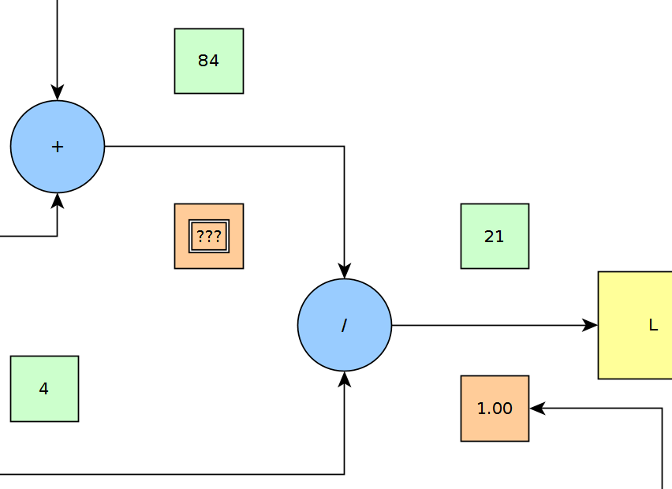
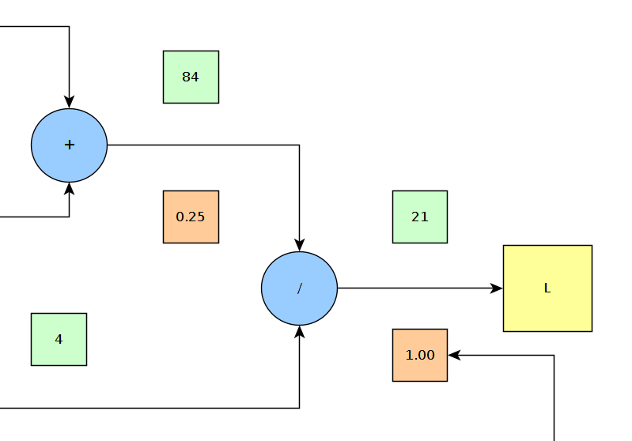
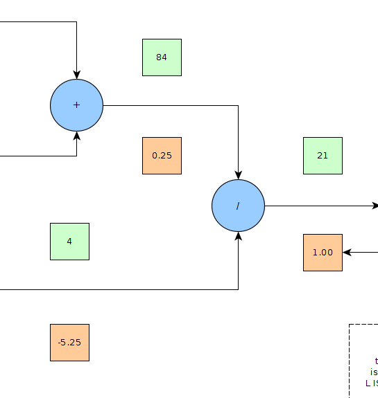
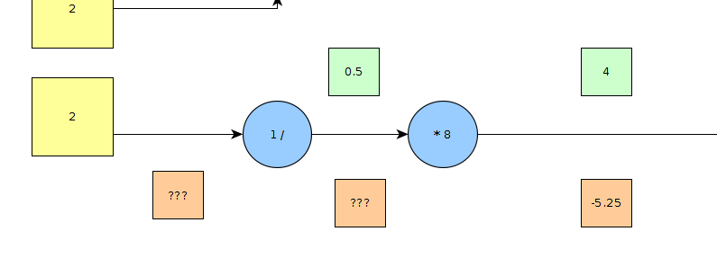
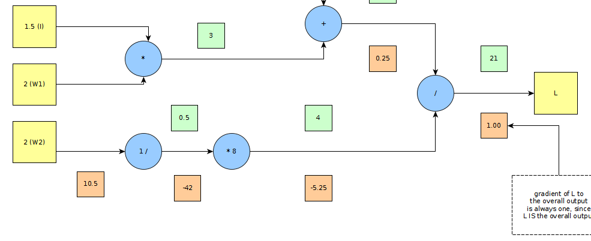
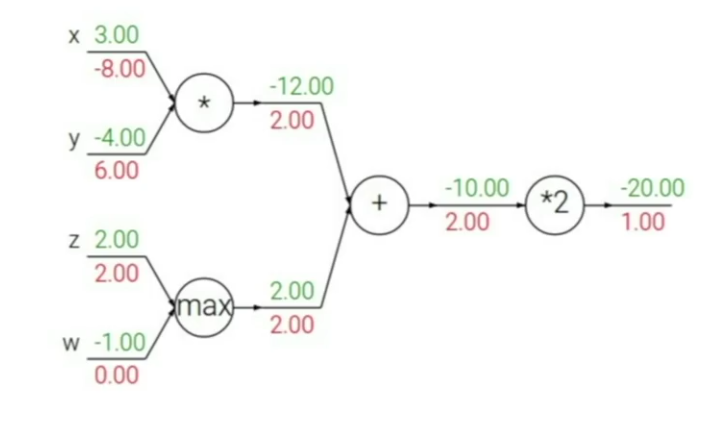
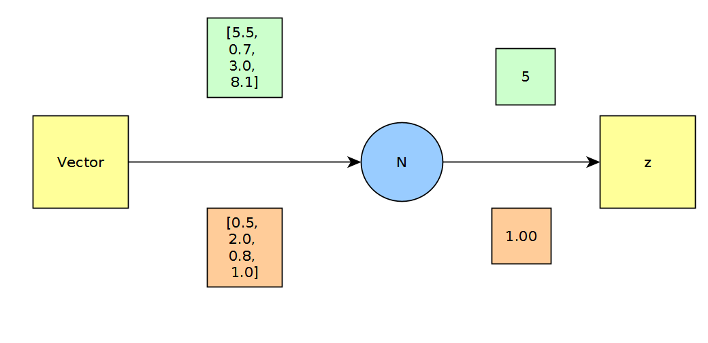
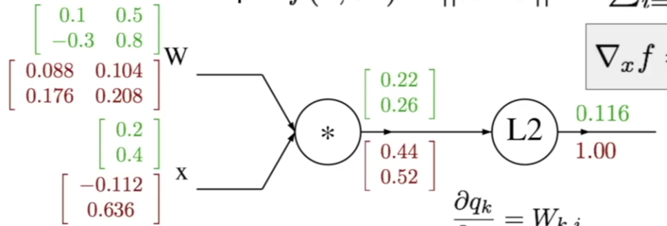

#

## Big picture

So let's summarize what we have so far:

## backpropogation

Ok so that graph represents a single pass. The whole idea of deep learning is to make lots of passes and refine `W` each time. As already stated, the way to refine `W` is to work out the gradient of `L` with respect to each element of `W` and then alter `W` those elements in some proportion to that gradient, and wash-rinse-repeat until we're happy with the resulting `L`.

The operative sentence there being *work out the gradient of `L` with respect to each element of `W`*. This is non-trivial. However there is a general strategy we can refer to:

1. Break `f` down into a **computational diagram** 
If `f(x) = (3W^2 + (W3 * W1)) / ((1/W2) * 8)` (`Wn` being elements of `W`). Let's assume the passed in image is already factored in there somewhere, maybe it's the `* 8`.

Then the following is an example of a computational diagram `c` for `f`

As we can see, the function `f` is broken up into a system of nodes that, when stepped through, perform the same function as `f`. 

2. Do a **forward pass** through `c`. This means just means step through `c` for the given elements of `W` to work out an output for each node and hence, eventually, a concrete `L`.

3. Do a **backward pass** where, for each node, you work out the gradient (i.e. the effect on the rate of change) of each ot its inputs on the *eventual* overall output. 

Very important to this is the **chain rule** (see calculus folder), which basically lets you work out the gradients of composite functions (which is what `c` is: a whole bunch of composite functions).

For example in our diagram, we want to work out the gradient of the first input to the `/` function, with respect to the ultimate output of `c` as a whole. 

We know the gradient (i.e. rate-of-change) between the output of `/` and the overall output: `1.00`, so all we need to do is

1. work out the partial derivative for the input in question (i.e. 84), 
2. multiply that by `1.00`

So, imagining that `/` is the function `f(x, y)`:

    f(x, y) = x / y
    y = 4
    f(x) = x / 4
    f`(x)) = (f(84 + x) - f(84)) / x = ((84 + x) / 4 - 21) / x
    g(x) = ((84 + x) / 4 - 21) / x
    ...

    eventually we get 0.25

OK so that's our gradient of this particular input with respect to the total output.

OK, now lets find the gradient with respect to the other input

    f(x, y) = x / y
    x = 84
    f(y) = 84 / y
    f`(x) = (f(4 + x) - f(4)) / x = (84 / (4 + x) - 21) / x

    ... turns out to be 5.25

So already we can see that our loss output is most heavily effected by the lower input of this branch, and that the lower that input is, the less loss we will experience. Let's just calculate the whole lower branch though:

    f(x) = x * 8  
    we want d/dx[f(0.5)]
    f`(x) - ((0.5 + x) * 8 - 4) / x = (0.5 + x - 0.5) / (x/8) = x / (x / 8) = 8x / x
    ...

    eventually = 8

Now we have the gradient of the `*8` function with respect to it's only input: `0.5`. We now want to get the gradient of the overall output with respect to that very same input `0.5`, i.e. how much does changing that input effect the overall function output?

We use the chain rule to get the answer

    8/1 * 5.25/1 = 42/1
    gradient of the input to the current node's output * gradient of the current node's output to the overall output = gradient of the current node's input to the overall output

Now we just calculate the final node:

    f(x) = 1 / x
    we want d/dx[f(2)]
    f`(x) = ((1 / (2 + x)) - 0.5) / x
    ...

    = -0.25
    chain rule -0.25 * 42 = -10.5

OK, great we've worked out the gradient of the Loss function with respect to the last input, `w2`. 

Now lets just work out all the gradients (keeping in mind we don't need to work out the gradient of the image). Just keep in mind that the gradients we actually care about are the gradients of the output of *the loss with respect to each node*. The gradients of inputs compared to the node itself aren't actually that important.

## Shortcuts

Now that we actually know what we're doing, we can take some shortcuts. We know, for instance, that the gradient of an addition node with respect to each of its input will simply be `1`, since the output is always increasing in *direct* i.e. 1-to-1 proportion to *either* input. We can make similar rules for other nodes. 

We can also lump nodes together. If we keep finding a common chain of 1-input-1-output nodes we can work out the gradient of the output of the whole chain with respect to the first input, and then keep sing this shortcut in future calculations. An example of this might be a **sigmoid function** which appears a lot in machine learning.

Basically the whole point of drawing out this graph is so that you don't need to calculate the gradients of these *insanely* complicated functions. Instead you can just break these down into a huuuuuuuuge computational graph and be sure of finding all the gradients you need using lots of simple gradients and the chain rule.

## But why?

We want to get the gradient of the overall loss with respect to every `W` input because then we know how much to update each input in the hopes of finding a better `W` that will generate a smaller loss next time. In particular, we know in what proportion to update each input (a steeper gradient for an input suggests it should be changed more in order to best minimize loss).

## Vector graphs

So this is all well and good but in reality when you are doing machine learning, each `Wn` is actually a huge vector. This doesn't actually change too much, it just means you have to calculate like a billion partial derivatives for each `Wn` going into a node, and all the gradients take the form of huge vectors of gradients. 

Put another way, now each node, like say the `*8` node, now takes a huge vector, and applies `*8` to each element in that vector, resulting in yet another huge matrix. With multi-input nodes like `/`, you'd take 2 huge vectors and return a single huge vector which is the result of applying each element of one to each element of the other.

Working back in the opposite direction, it also seems pretty intuitive. Lets imagine we have a node `N` that takes in a vector `v` and returns `z`. To work out the gradient of `z` with respect to `v` you just generate a gradient for each element in `v` which represents what effect that element had on `z`. *The gradient of a vector is always going to be the same size as the original vector.* This is a useful sanity-check you can do while coding.

A common size for a `W` is 4096, sooooo quite big. 

## To code

When actually coding all this out you'll be making something with much the same structure. You'll have some forward-passing algorithm that computes the output for each node given the inputs, and then you'll have some backwards algorithm that computes the gradient for each input of each node with respect to the *overall* output, and finally returns the gradients of each initial input with regard to the loss.

You can imagine how to implement this in an OO way pretty intuitively, each node should:

1. calculate an output
2. calculate the gradient for that output with respect to each input
3. be able to find the gradient for the loss function with respect to each input if given the gradient of the loss function with respect to the output (i.e. by multiplying this latter gradient by the gradient for a given input, which we calculated in `2.` already, see **chain rule**)

Example library that uses this approach: Caffe (look for the `layers` source codes).
