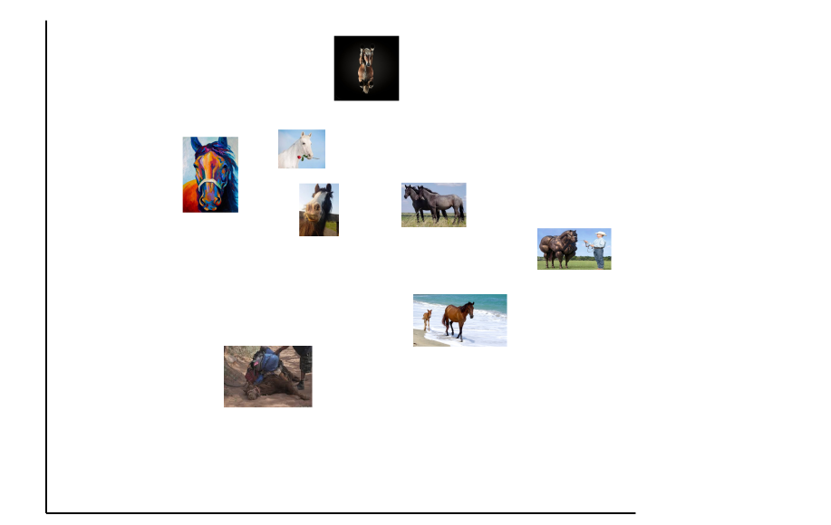
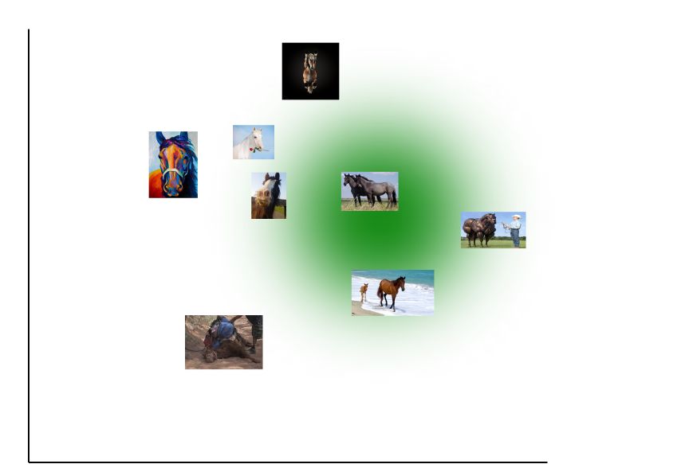
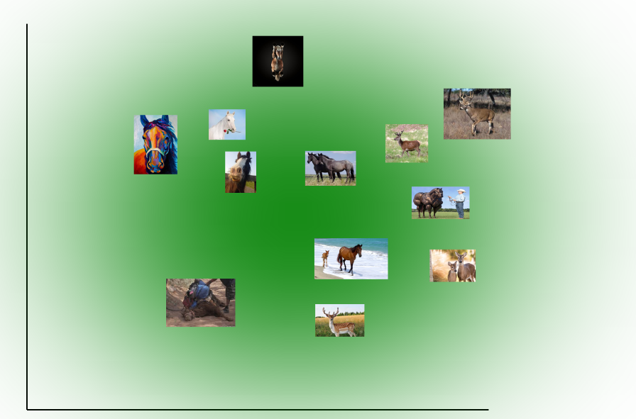
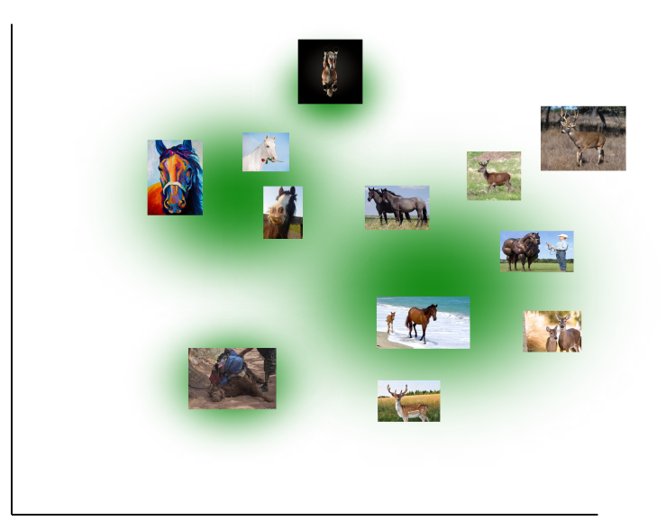

# Neural Networks

A **neural network** in this case just refers to a class of functions.

This class is: all those functions which consist of groups of linear functions composed with non-linear functions.

So for example, our classic classifier function we've been using so far looks like this:

    f = x * W = c

Where `x` is some image, `W` is our weighting and `c` is the classification (which could be a vector). If you recall all this does is multiply the pixels of the image with each weight of `W` to get a score. This is *not* a neural network.

An incredibly simple example of a neural network might be something like this

    f = W2 * max(0, (x * w)) = c

Here we have two different weights, `W` and `W2`, and an additional, *non-linear* function `max(0, x)` (non-linear because it does not create a straight line when graphed yo, recall **hinge loss**). This *is* a neural network simply because it is composed of some linear functions (`W *` and `W2 *`), plus a non-linear function. How it actually works is: 

1. You multiply each pixel in the passed in image `x` by `W`, to get the new vector `v`
2. You get the max of each integer in `v` and `0` to get a new vector `v1`
3. you multiply each integer of `v2` with `w2` to get the final result vector `c`

## But why

Remember one of the issues with simple linear classifiers is that you can often only ever look for one kind of property, when the things we want to identify usually have lots of different properties. Let's say we're looking for horses. One property of horses is that they are often brown, so we might want our classifier to look for large blobs of brown pixels anywhere in an image. That's one property. On the other hand, another property of horse images is that they often depict a horse in a field of grass. So we might also want our classifier to look for green pixels at the bottom of the screen. 

A single template `W` cannot really look for both of these properties at once. On the one hand you'd want it to give high scores for big blobs of brown pixels *anywhere* in the image, including at the bottom. On the other hand you'd want it to have high values for green pixels at the bottom. This seems ok, you might say we'd just give high scores for green or brown pixels near the bottom, but then we'd be giving high scores to things like green-and-brown checkers boards or pool tables.

The issue is that the thing we're trying to identify will probably appear in a bunch of very different looking ways Put another way, our target probably has a number of different properties which can be used, single-handedly, to identify it (you can work out that you're looking at a cat by looking at an image of it's face or it's tail or a close up of its paw, etc). If we make our linear classifier lenient enough to classify any object which has *any* of those properties, it will almost certainly be *too* lenient, and mis-classify a bunch of non-target classes as the target class. 

The solution, which by the way is pretty obvious when you think about it, is to just have a lot of different templates. You check your image to see if it contains a paw. Then you check for a tail, then you check for a cat face (using different templates each time). You aggregate the scores, and based on this you make your classification.

*and that's a neural network*, just multiple layers of these weightings applied to your test image. Not really sure why we need the non-linear functions though.

## More graphy version

Think again of all possible images being represented on a graph (say every point on this graph represents a whatever x whatever vector, with vectors that have low l1 difference being closer together), and imagine we're trying to identify all the horses:

We can already see that these images are far too spread out for us to be able to ever classify all of them with a single template using the l1 distance. This is because a single template will only ever be able to capture images radiating outwards from a single point (assuming we're using l1 distance for or classifier). If we make our strategy (with the single template) too stringent, we'll miss some horses:

But if we make it lenient enough to capture all horses, it will also capture lots of non-horses:

So the obvious solution is: *multiple templates*:

Not sure why we need the non-linear functions though.

## Deep neural networks

This is *literally* just a neural network with a lot of layers lol.

## Biological analogy

    