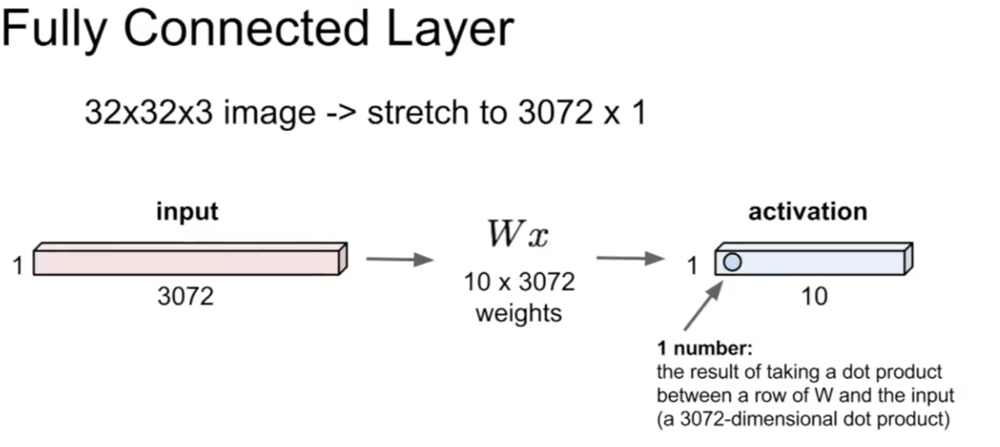
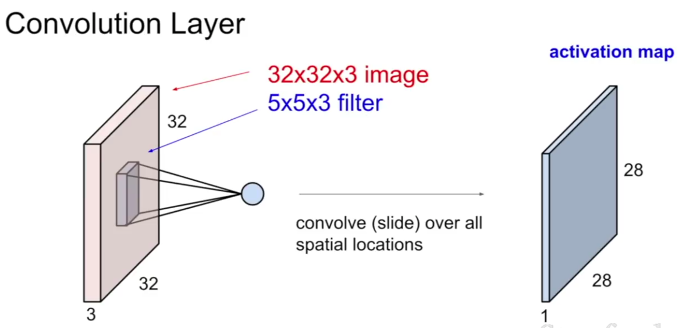
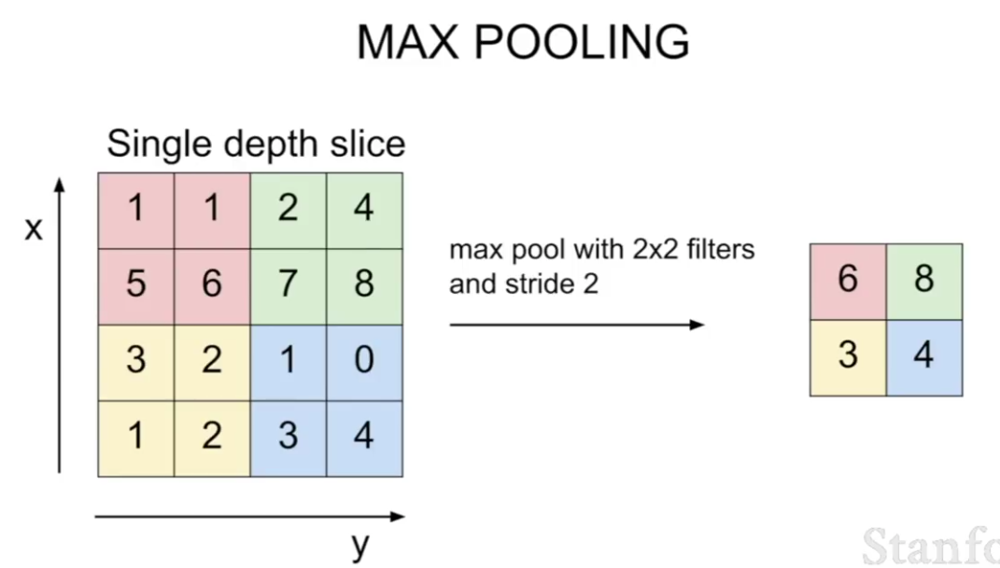

# Convolutional Neural Networks

These are a different set of functions that are different from straight neural networks.

## How organic image recognition works

Certain neurons are sensitive to certain parts of the visual field. 

The cells in charge of vision have a hierarchical structure:

1. At the bottom layer you have cells that stimulate whenever they perceive "circular regions of spots" whatever the fuck that means. These cells go on to stimulate the second layer.
2. This layer (called **simple cells**) seems to get stimulated in response to oriented edges (i.e. they fire differently depending on the orientation of the stimulus). These go on to stimulate the next layer.
3. Which fire in response to orientation, and movement as well.

And things get more and more complex from there up.

# Layer Types

## Fully connected layer

This is a layer which takes an **input**, so like 32x32 pixels, converted to a 3072 x 1 vector, compares it to a template (`W`), which would probably be a 3072 x n vector (where n is the number of candidate classes), and produces an **activation**, a 1xn vector, representing the score for each class.

We've seen this before though, this is normal.

## Convolutional layer

This is very very similar to the fully connected layer indeed, but also wants to keep the spatial dimensions of the image intact. Because of this we do not convert images into long vectors in a convolutional layer. We allow them to keep their 32x32x3 (or whatever) volume.

We then process these spatially intact images by passing a **filter** over the whole image and extracting data related to each possible location on the image. The filter will always have the same depth (so red, green, blue) as the image being filtered.

An example filter might be a 5x5x3 matrix. The filter will generate an activation from the pixels it is currently being compared to. Essentially we act as if the filter and the 5x5x3 section it is sitting against are the whole image of a fully connected layer (although we might not bother actually turning either into a vector) except that Each application of the filter produces a single result rather than a vector of 10 or whatever.

You might also add a **bias** to make some classes generally score higher.

**convolve** is the act of passing over the whole image (i.e. a filter convolves around the image). We can use a number of strategies for how exactly to convolve, but a general strategy is to center the filter over every single pixel in the input (where this is possible, clearly we cannot center over the edges) and apply the filter, mapping its output into the corresponding pixel on the output. You can also like, step two pixels at the time. It's up to you.

Point is you end up with an **activation map** a location-sensitive map of all the activation scores for every application of the filter

You generally have a bunch of different filters for each convolutional layer. Each filter adds an additional activation map, or, if you like, an additional layer of depth to the existing map.

## All together now

Essentially the meat of your machine will be a chain of these convolutional layers feeding off of each other to eventually identify high-level features.es

The idea is that the early conv layers pick up very low level features (like lines and edges), and later layers read these maps of low level features and try to identify high level features (long lones, shapes) and so on until we identify something with meaning, like a horse tail for instance. Kind of like the visual neurons.

The final layer will probably be a fully connected layer, which will generate the final class scores (because spatial location probably doesn't matter so much at this point).

## How to convolve

In practice we don't use strides that don't fit nicely into the image size. 

The formula for working out how large an activation later is going to be for a given input is:

    (input length * filter length) / stride + 1
    (N * f) / s + 1

This will be the length of the activation layer at least, perhaps the width is different. Anyway, if this equation doesn't give a whole integer, then you should probably pick some different numbers.

OR, you can **zero-pad** (i.e. add a single row of 0-valued pixels around all edge of the image) the input to:

1. Allow the filter to get a better picture of the features near the edges
2. Make sure the activation map is the same size as the input 

The zero-padding might add some distortion, but usually this doesn't have to big of an impact. It's common practice to decide on filter size and stride and then just pad as needed.

We want to maintain the input size because if we start shaving away a few pixels each time, pixels that used to be slightly before the edge (and hence fully analyse-able) end up on the edge, which makes them difficult, if not impossible to analyse. If we keep the activation map size the same as the input, the edges get a bit distorted and hard to use (and in fact I think the distortion is going to creep inwards), but we preserve at least some data around the edges each time, making the pixels slightly in from the edge more meaningful (by comparison).

## Bias terms

Each filter probably has a **bias term**, which is used to alter the activation score a little manually to account for certain things (like some classes being more common in the test data than they really ought to be).

## Pooling layers

There are some benefits to having a smaller input size to work with though. They are:

1. The smaller the input the less parameters you'll have to deal with at the end (remembering that the final layer is a fully connected layer, so it will have a parameter for every single pixel in its input)
2. The larger your images the more calculations you will have to do as your filters convolve around them, so smaller images will process faster.

Pooling layers help cut down the size of your inputs by aggregating spatially close pixels together into a single value. A good example is **max pooling**

So in a pooling layer you'd take the, say 32x32x10 input (so the last convolutional layer probably had 10 filters) and reduce it down to like 16x16x10, hopefully preserving all of the useful data along the way.

You actually do the pooling like a convolutional layer, with a filter of a certain size and a stride and everything. The difference is:

1. You'd probably only ever have one *type* of filter per pooling layer, it would process all the input layers in the same way
2. This filter never has its weights updated ever
3. Probably no zero-padding
4. You probably make the stride the same as the filter size to avoid overlap, because you're only trying to preserve the data that is already there, and to do that you probably don't need to process any of it twice (rather than what you'd do in a normal conv layer, which is try to get insights out of raw data). 
5. Usually with a size of 2x2

Theoretically though, you can (to some extent) just use a larger stride in your conv layers to **down-size** your activation maps for you. This is probably cheaper at the very least, and apparently more in favor lately.

