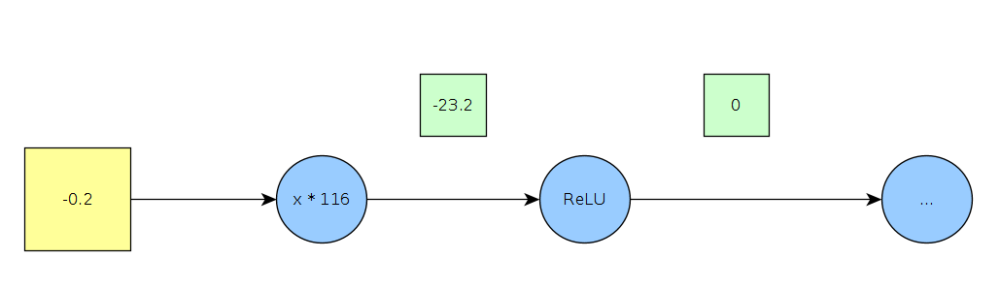

# Mini-batch stocastic gradient descent 

This is the name we give to the whole process of training a network:

1. Sample (get mini-batch)
2. Forward (pass in the sample, calculate loss)
3. Backpropogation (work out the gradient of the loss with respect to each parameter)
4. Update each parameter according to the relevant gradient.

# How to train a network

## Activation functions

Another common layer is an **activation layer** where we apply an **activation function** (the same activation function) to every cell in the input. Usually these go directly after a conv layer.

### Sigmoid

    s(x) = 1 / (1 + e^-x)

So what it does is takes the input and squashes it into the range between 1 and 0.

#### Pros:

You can think of it as the "firing rate" of a neuron (with the activated weight being the neuron), so that's nice

#### Cons:

Highly activated cells (imagine say, 10) will be reduced to a number like 0.001 or something, which is very small. Now consider what this means about the gradient. The rate of change form the input (10), to whatever comes after the sigmoid gate is going to be tiny. That is to say, changing the 10 to a 15, or an 8, is going to have *very* little impact on the output of the sigmoid (the same is true for pretty much any activation > 1). This is not so good, because we want to register differences in > 1 activations as being significant. In addition, this will have the effect of ascribing very little impact to any of the computational nodes that lead to the > 1 activation value.

In addition sigmoid involves an exponentiation operation, which is kind of expensive, though this isn't such a big deal considering how hideously expensive everything else is.

Lastly the output of a sigmoid function `o` is always positive. which means it won't be **zero-mean**

### zero-mean

A function is zero-mean if it is generally generating outputs that, when aggregated, have a mean of 0. Most functions in your neural network should try to be zero mean because otherwise in the update step you might update a bunch of your weights in the wrong direction.

Let's take the example of the sigmoid function. Every output of the sigmoid function is positive. This means that the local gradient of each input `in` to the output of a sigmoid will always be positive. This means that each input will end up with a positive gradient, so during backpropagation all input will be adjusted in the same direction (even if the inputs were on opposite sides of `0`). 

For instance, consider a situation where two inputs `a = 2` and `b = -2` are passed into a sigmoid, and then passed on to a `x^2` node (the purple vector represents the local gradients).

Suppose that for some reason the loss-minimizing value for both `a` and `b` is `1`. This is the value that we should be trying to reach during backprop.

Let's also say that the rate of change of the loss with regard to any input to the output of the `x^2` function is `6/1`, let's calculate the gradients of the loss function with regard to both inputs.

And let's imagine that `a` and `b` are base weights of our function, and that we're updating each weight by adding the the inverse of the gradient of loss function with respect to that weight (because we want to minimize loss).

As we can see, we have subtracted some amount from both values. In fact, as long as the gradient of the loss with regard to the output of `x^2` remains positive, we will continue to subtract some amount form *both* values. Indeed all values will end up smaller on the next round, no matter what they are. Similarly, if the returning gradient was negative, all values would be increased, regardless of whether they were higher or lower than optimal. 

The ultimate result of this is that on each update you're more or less guaranteed to have some values *further away* from their optimal value than on the previous round. This causes a kind of *zig-zag* optimization pattern (as some values are dragged further away from optimal in the direction of the majority), which is clearly much less efficient than simply homing straight in.

## ReLU

 f(x) = max(0, x)

A hinge loss function.

### Pros

Leaves the + direction alone

Very cheap

"converges much faster"

### Cons

not 0-centered

**dead ReLU's** which occur when some of your inputs are > 0, and so don't effect the loss at all, meaning the ratio of the rate of change of the loss compared to them is 0, so they will never get updated either. 

So for instance if we have a weight of `-0.2` which is multiplied against a certain pixel value, say `116`, and the result of this is passed through a ReLU node.

The local gradient of the input to the output of the ReLU is clearly `0`, so no matter what impact that output (i.e. `0`) has on the loss function, we're never updating our weight ever. Each update will have it stick at `-0.2`. 

This will only change when the previous node changes (i.e. when we switch images I guess, and this weight starts pointing at another pixel with a negative value). Even so if we consider every sample in the given mini-batch, there will be some weights giving dead ReLU values for *EVERY* input in the mini-batch. Which is kind of annoying, since we're computing a lot of stuff to pass values against these weights only to end up with 0's.

dead ReLU make up about 10-20% of any given network as it's being trained (which is sux).

But keep in mind, as weights in previous (i.e. upstream) layers change, or as the initial input changes, ReLU which used to be dead might come alive again.

#### Countermeasures

Often a source of dead ReLU is the initial weights, some of which will just be negative or too steeply negative to begin with, and will thus become dead. To stop this we can sometimes initialize our weights with a slightly positive bias (something like `0.01`). This might not even be good though.

## Leaky ReLU

    f = max(0.01x, x)

I.e. just the same except that rather than `0`, negative values will give us small negative values instead.

### Pros

Still efficient
Still leaves the positive values and their gradients untouched (unlike sigmoid)
Doesn't die, because updates still happen to negative inputs to relu nodes, they just happen a lot slower. 

### cons

Still not mean-0, although it is closer

## Parametric rectifier

    f = max(yx, x)

Exactly the same as the leaky ReLU, except that rather than setting the constant `0.01`, we can change this value as we go.

## Exponential Linear Units

f = {
    x > 0: x
    x < 0: y * (exp(x) - 1) 
}

Exactly like Parametric rectifier, except we also take the exponent of `x` so that larger values of `x` are only a little bit negative, rather than quite negative.

## Pros

All the good bits of leaky ReLU, but also we don't get very large negative values, which is bad for some reason

## cons

A bit expensive because of the exponential

# Choosing an activation function

Generally just use ReLU, that's best practice for now. You can trial some others if you're super keen and compare the results. Tanh tends to be kind of meh, and sigmoid is very bad.