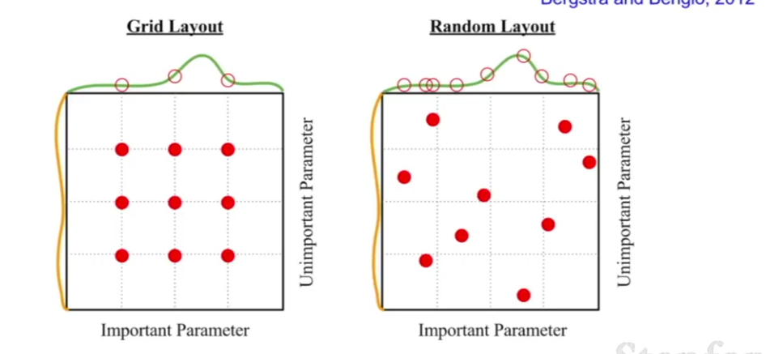

# Babysitting

Basically this is things you will do manually, like choosing hyperparameters. You're going to be doing the following:

1. ## Preprocess the data

pretty straightforward.

2. ## Choose and build an architecture

3. ## Do a single forward pass

The less you get at the end of this should be *reasonable*. Reasonable depends on the specific architecture, but refer to the softmax classifier for a decent example.

Next, once the loss is reasonable, add a little regularization. This should make the less go up, because the network is now no longer learning for this specific set of images so well, it's learning some more general patterns.

4. ## Do a basic train

Now pick a small training set, like 20 or so inputs, turn off regularization and make it learn. Because the sample is so small and we're not regularizing, we should be able to make the loss go to close to 0 as the network learns to categorize these specific images really well.

5. ## Start training in earnest

Set regularization to a small number and trial and error (with a small-ish batch of inputs) until you seem to have a good learning rate. If the loss isn't chaining it could easily mean that the learning rate is too low. If the loss is getting really big, your learning rate is probably too high (sometimes you'll get `NaN`'s in this situation).

A good learning rate is probably between `1e-3 and 1e-3`.

6. ## Hyperparamater optimization

Do cross validation to pick good hyperparameters. You generally start off "coarse" with large or extreme values for your hyperparameters (or rather an extreme range) and only a few learning epochs. This should allow you to get a good feel for what direction to move things in quickly. You then narrow in on good values and to more and more epochs to get a good sense of what further tweaks to make.

So for example you'd start coarse. You'd pick a range for your regularization number and a range for your learning rate, and sample 5 values for each within and run a total of 25 trials for a few epochs. See which gave the best results and move on to the fine phase. Generally we define the ranges in orders of magnitude, eg `10**uniform(-5, 5)`

For the fine phase, you'd narrow in on better ranges for both paramaters, e.g. `10**uniform(-4, 0)` and see which parameters get better results. For a 2-layer neural network with 50 hidden neurons, 53% is a pretty good accuracy rate. Ideally the best scores in this fine pass should be in the middle of the range of hyperparameter values you're sampling, otherwise keep shifting the range till they are probably.

### grid vs random

So say you have chosen a range of 0-100 for your regularization parameter. It might be tempting to choose values that break up the value space as evenly as possible, i.e. if you intend to sample 4 values you might choose 20, 40, 60, and 80. In reality though, random 4 random values will probably be better because you'll cover more individual spots on the overall value space:

## In practice

Ultimately you'll be doing a fuckton of trial and erroring hyperparameters. 

Here's some helpful tips for learning rate though:

And if the graph of your loss function vs training epochs looks a bit like this:

Your initialization strategy is probably fucked.

And a large gap between training and validation accuracy is probably a sign that you;re over fitting.

A very low gap means maybe you could try to lean a bit more towards over-fitting, this could improve the validation accuracy even if it produces a small gap between the two.

Lastly, the ratio between the size of our values and the size of the updates we make to our values should be around `0.01`. So mean weight value size / mean update size should be `0.01`.