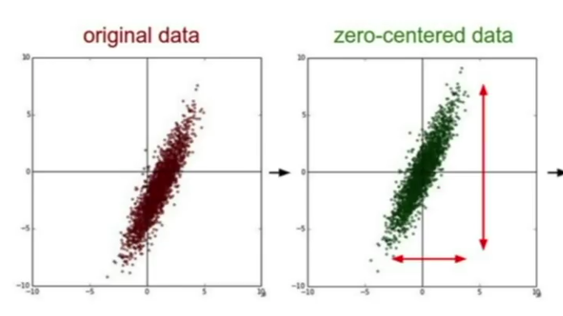
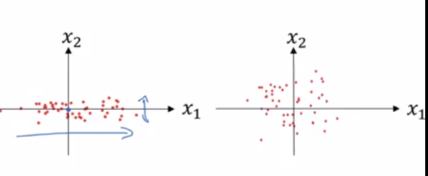
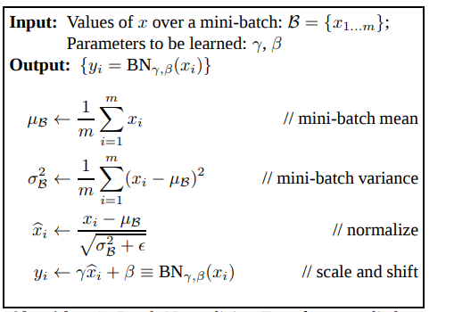

## Preprocessing

So you've got your data. It's probably pretty randomly spread out, so we want to do some things to it before training on it.

1. ## zero-centering

    The process is quite simple: go through your entire data-set and find the mean for *every single dimension*. Then simply subtract that mean from each vector in each input, and you're done. 

    Your data is now 0-mean, i.e. it's average is exactly on the 0 point for each parameter. Put another way it is now equally weighted around the 0 point.

    

    A more precise way of doing this is to calculate a **mean image** which makes up the average pixel values for all images (so 32x32x3), and subtract that image from every image in your test dataset.

    The reason why we do this is that, if our data cloud is off-center, very small variations in our neural functions might have larger impacts on our loss.

    For instance if we don't zero-center the data you might end up with a starting situation that looks a bit like this

        [+3.0, +4.0, +6.0, +7.0, +8.0] << data
        [+0.1, -0.2, +0.1, +0.5, -0.3] << weights of first (fully connected) neuron
        [+0.2, -0.1, +0.2, +0.6, -0.2] << weights of first neuron varied slightly

    When we multiply these together we'll get an output of:

        [ 0.3, -0.8,  0.6,  3.5, -2.4] sum = 1.2
        [ 0.6, -0.4,  1.2,  4.2, -1.6] sum = 0.4

    As we can see there is a high amount of variance between these two outputs, despite the two neurons being quite similar. If we zero-center the data, the input will be:

        [-2.6, -1.6,  0.4,  1.4,  2.4]

    And the outputs of our two neurons will be:

        [-0.26,  0.32,  0.04,  0.7 , -0.72] >> 0.08
        [-0.52,  0.16,  0.08,  0.84, -0.48] >> 0.08

    Which is much more similar (the same in fact). This is just one example of course, but you can see the principle: small variations cause less drastic variations if we zero-center our data. You can test this on like 10000 similar arrays instead of 2 and you'll find there is a lot less deviation for the zero-centered inputs. 

2. ## normalizing 

    First you find the normal variance which you do by going through each vector `v` and finding the sum of all the *squared* values for `v` across all the inputs, and dividing by the total number of inputs. You do all this *After* zero-centering the data.

    This is the normal variance. You could write this a little more mathsey:

        sum(vector value ^ 2, for each input)/ the total number of inputs

    You then divide each vector in each input by it's normal variance.

    

    The reason we do this is to try and keep the optimal parameters on roughly the same scale as each other. This way we can make roughly uniform-sized updates to all our parameters at each step and have them all progress towards the optima at roughly the same pace, rather than having some reach the optima and have to wait for other parameters to make many more steps towards a very distant optima, while still others zig-zag back and fourth over a tiny optima.

Generally we don't do too much preprocessing in CNN because we're usually working with images and it's non-trivial to find ways to mess with image data without losing some of it. zero-centering is an exception.

ALSO: any preprocessing you do to the training data you must do to the test data too before actually testing or else your algorithm will fail horribly. So normalize your test data according to the same mean and variance as you used on your training data.

Also, you process the entire dataset at once, you don't preprocess each batch or anything.

## Batch Normalization

The idea is that this isn't important *just* in the initial input layer. Like, you want to zero-center your data so that the standard deviation of the first layer isn't really high, and you want to normalize it so that all the value of the input dimensions have the same scale as each other. We want the input dimensions to have the same scale because if this is the case the optimal parameters for the inputs will also all have the same scale. Given that we will be using one constant learning rate (or at least our updates will be based off of the one constant learning rate), it would be nice if all optimal parameters had the same score, because it means we won't zig-zag up and down past the small-scaled optimal parameters, while slowly ramping up to the large scaled optimal parameters.

Ok, so this is why we normalize and zero-center the initial data: to help the first layer have consistently varied outputs, which then helps all subsequent layers with their own outputs.

The insight with **batch normalization** is simple: why not do this to the inputs of all layers, not just the first? The advantages are exactly the same (just the deeper you go into the network the less it matters since the outputs you will be generating won't go on to effect as many layers). Plus what can happen in a normal NN is that as parameters near the start of the network get better in tune, the scale or skew of their outputs can change, which can be detrimental to the efficacy of later layers, which have already tuned themselves to the initial levels of scale and skew, and now have to spend some iterations re-training to fit the new sale/skew, while also still trying to minimize loss. If we normalize the scale and skew on each layer, this won't be a problem.

Based on this observation, batch normalization can be implemented practically by taking the output of a fully connected (or conv) layer, zero-centering it, normalizing the zero-centered data, and then passing it into the activation layer. 

    fc layer -> batch normalization layer -> activation function

There is one issue with this though: processing outputs like this could remove important information from them. 

For example, let's say your fc layer has one neuron which is looking to identify straight black lines, and another that is looking to identify white splodges. You pass in lots of inputs, well and good, but it turns out that in a lot of these inputs there are some fucking perfect examples of straight black lines, like platonic examples. Because of this, the straight black line neuron keeps on going off the rails and generating very high activations. There are only ever very iffy examples of white splodges though, so the white splodge neuron always gives very low activation scores. 

By normalizing this data you will scale down the black line activation scores, and possibly scale up the white splodge scores. This is bad because this data is important and reflects reality. 

The solution to this is to add two learnable parameters, `M` and `B` to the batch normalizing equation which effectively *un* zero-center and *un* normalize the recently batch normalized data. The idea here is that in cases where differing scales or skewing is justified, the network will learn to undo the batch normalizing process by an appropriate degree (i.e. the network can learn to make BN layers just be identity layers if need be).

The actual batch normalization formulas are here (they're quite nice). `M` and `B` are applied in the `//scale and shift` step:

Note the `e` is a "smoothing term" to ensure numerical stability (i think this means avoiding zero, or just really really really small floating-point divides).

Importantly during testing these averages and standard deviations are calculated with respect to *each minibatch* of data that gets fed through the network. This is faster than calculating them with regard to the whole input and any noise should be averaged out in any case. During training however, you want to calculate these with regard to the whole test set. You also don't want to keep updating `M` and `B` during testing, you just use the final values of these from training. 

The *most* important thing to remember about BN though is: it works, and everybody uses it, so you should too.

### batch normalization regularization?

BN also helps regularize a model slightly. Consider, the output of each layer for each input is now passed through this BN function, and the exact weighting of this function depends on the current minibatch. 

So instead of the output of the model for a given input being a product merely of the weightings of that model vs the values of the input, the output of a model with BN is now also effected (somewhat) by which other inputs are in the current minibatch.

Because minibatches are chosen randomly, this adds a bit of randomness into the network, which penalizes weightings that try to be too specific. 