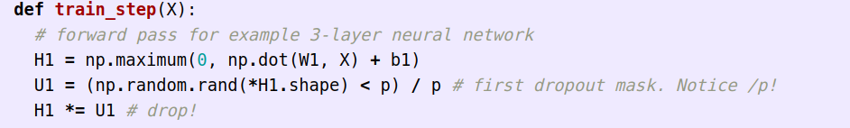
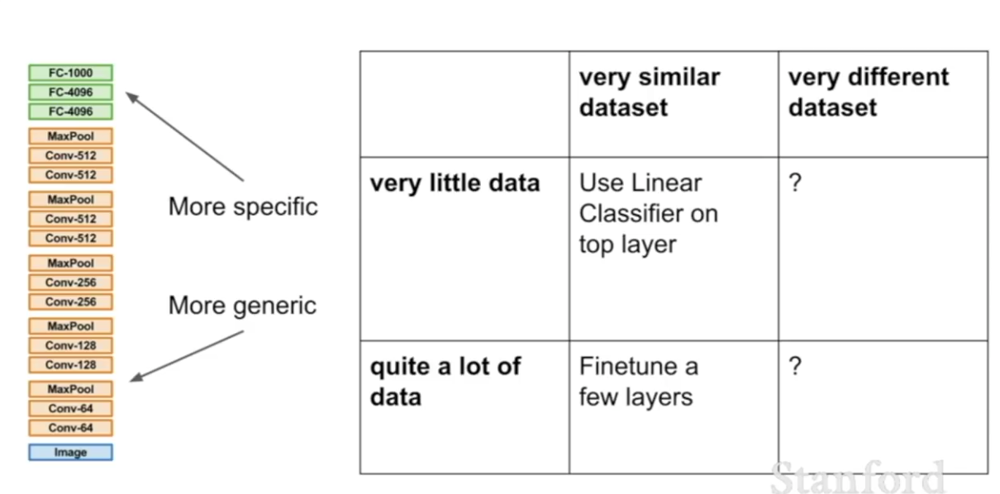

# How to ensure your model will perform well on test data

## Model ensembles

You literally train like 10 models (like, train your model 10 times, maybe with different hyperparameters) and then at test time, generate a score for each test input by averaging the score of that image on all 10 of your models. This *does* help, but only very slightly. > %2 more accurate generally. People in competitions do it a fair amount.

A kind of cheat way to do this is just take snapshots of your model at different points during training. 10, to be exact, and just average out the predictions of these (I guess the idea is that your 10 mini-models will vary from the optimal model in more or less random ways).

## Regularization strategies 

Generally what you want to do is introduce some kind of randomness into the network at training time to prevent over-fitting. Often you might not have one in place to begin with, but add it in later if you start to see that your network is over-fitting.

### Dropout regularization

On each forward pass, set a bunch of cells/neurons/activations to 0 at random. You'd to this most commonly in fully connected layers, but also maybe sometimes in conv layers. This does generally make training take longer, but you end up with more accurate predictions at test time.

This is good, in theory at least, because if you don't do dropout the network might only classify a thing as a certain class if it has all of the common features of that class in the training data. For instance, almost all the horses in your training set have eyes and a mane, so the network learns to depend on both of these being present. In realty though we want it to identify horses that only have one of these, or sometimes none. By adding dropouts, we force the network to be able to classify classes more generally/with more lenience, rather than depending on the presence of specific features.

Another idea why this is good is because it is a bit like you're no longer training one network, but an ensemble of networks (but with each network being some subset of the actual non-dropped out network).

Generally you have a probability of dropout `p` for each neuron around `0.5`, which, yes that does sound crazy high.

#### What about test time?

So you have trained your network with dropouts, and it seems to be getting good scores and now it is time to test, do we still use dropout?

We probably don't want to remove it alltogether because our network is getting good scores, using dropout. If we remove it, our predictions will probably be a bit off (because the network has kind of *learned* to expect some dropout). 

We probably don't actually want to have random dropout at test time either because the randomness could hit a really bad value and cause some terrible predictions. 

Instead what we do at test time is keep all the neurons, but calculate the probability for each neuron, that it would have dropped out (or been effected by dropout I guess) and multiply it's value by that probability. This way the network is kind of getting the kind of values it expects to make good predictions and we don't have to deal with terrifying rng.

Doing this is quite common.

### Inverted dropout

Maybe you want to be very efficient at test time. If so you can still use dropout *and* avoid the extra multiplication by the drop-out probability. All you do is, during training you create your dropout matrix with all the 0's, and then you divide it (i.e. the non-dropped values) by the probability of dropout (so making all the 1's in the mask into 1.5's or something). This makes the non-dropped values artificially higher during training time, so that at test time, when you remove the drop outs and *dont* raise any of the values, you'll end up with exactly the same expected values for each neuron.

This is also nice because it means you can tweak the dropout around without touching your test-time code.

Basically always use this rather than vanilla dropout.

### Data augmentation

We can randomly transform some of the images (or maybe a lot of them) in ways that still clearly preserve their label. For example, you can just flip an image, and it still should be classified in the same way. You can also use random crops. Brightness too. 

Basically you train against these randomized images and see if you performed as well as you did on the actual data.

### Stochastic depth

Randomly drop whole layers. Yeah, cray, but somehow it doesn't fail horribly.

## Transfer Learning

A solution to the issue of small data-sets. 

1. Train a big huge network on a big huge dataset that is *similar* to the dataset you are trying to classify untill that network is really good.

2. Freeze the entire network's weights so they are no longer being updated.

3. Add like, a single fully-connected layer at the very end of the huge network, that takes the network's last fully connected layer and tries to map its output to the classes you care about. This last FC layer is not frozen

4. Train this last layer by running training set inputs through the whole network and updating the last FC layer until it can read the output of the network in a way that lets it classify your classes well.

5. If you have a bit more data, once the final FC layers are trained properly you can even go back and start training the whole network a little so that it fits your dataset a bit better. If so you probably want quite a low learning rate, because since `1.` we can be pretty confident that the main network's weights are probably quite close to where you want them to be anyway. They're at least in the right ballpark.

As a general rule of thumb... 

transfer learning is pretty darn common these days.