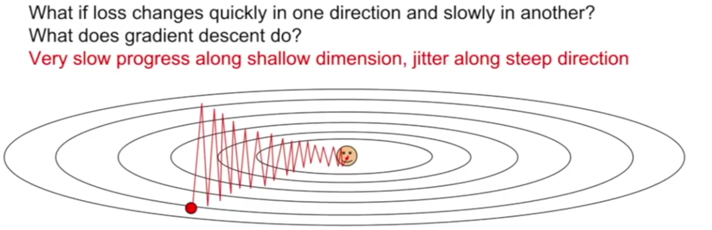
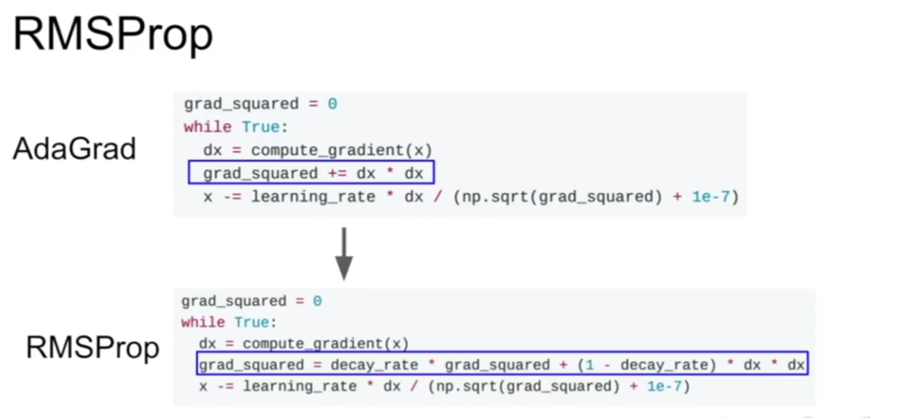
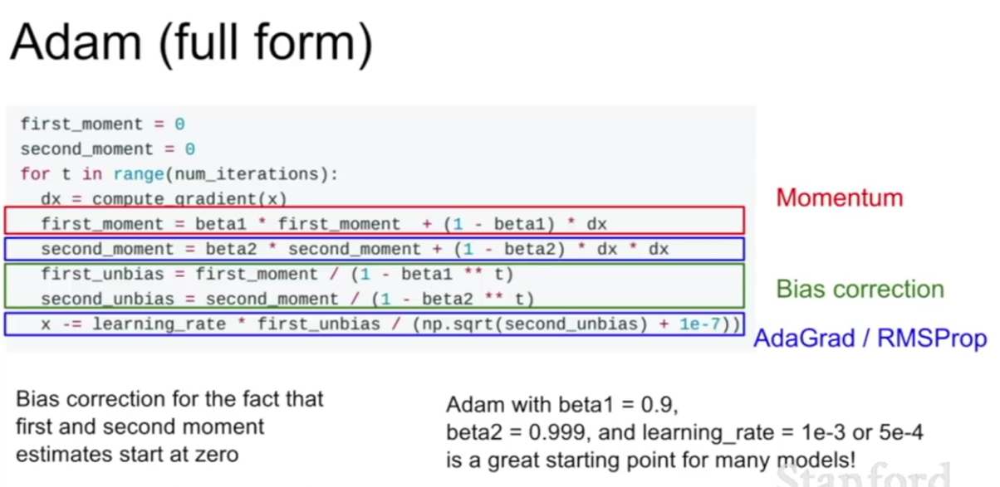

# More tips on learning rate

A good learning rate might mean it takes 6 hours to a day of training to train your network. 

A good fact too is that the optimal learning rate is usually independent of other hyperparameters.

Local minimum usually isn't an issue.

# Fancy optimization

Recall the vanilla gradient descent (Stochastic gradient descent) optimization method:

1. Calculate the gradient of the loss with respect to each weight
2. Add the *negative* gradient of each weight multiplied by the step size to that weight's value
3. These are the new weights. Wash rinse repeat.

## Issues

1. ### Bad Condition Number

    Let's say we have only 2 parameters, `W1` and `W2`. Lets then say that the loss is very sensitive to `W1` and not very sensitive at all to `W2`. You can think of the loss landscape looking like a hard taco shell, where moving north-to-south the loss (vertical axis) changes very fast, but east-west it barely changes at all.

    This kind of loss function can be said to have a bad **condition number** (difference in the impact between the largest and smallest parameters).

    What is stochastic descent going to do here?

    Basically the issue is: your learning rate is probably too high for `W1` and too low for `W2`. So on each epoch the `W1` gradient is going to be high, so we're going to update `W1` a lot, and the gradient of `W2` is low so we won't update it much. BUT, the optimum loss still needs to be reached, and we're too far away from it because:

    1. `W1` probably over-shot it's mark (went from a high gradient in one direction to a high-gradient in the opposite direction)
    2. `W2` is still very far away from where it wants to be

    So SGD is going to have to run through a bunch more iterations of this.

    

    The more parameters you have the more likely we are to run into this issue, since more params probably means larger max ratio between the highest and lowest.

2. ### Local minima

    basically this:

    

    A **saddle point** is kind of similar. It occurs when you hit a point of 0 gradient (in geographical terms, flat), because this will mean no further change and the parameter that hit that gradient is stuck. Even if the gradient isn't 0 exactly, if it is very small you'll progress very slowly, which is almost as bad.

    In practice you get more saddle points compared to local minima the more parameters you have (since apparently with more parameters you're almost sure to have at least *some* that have a negative gradient, which can help get the others out of the hole).

3. ### The Stochastic bit

    Recall that you don't calculate the gradient for every parameter on the whole training set because that would take too long. Instead you use mini-batches. Well, these mini-batches probably generate gradients that are slightly off from the true gradients. This means the updates you make might be slightly in the wrong direction each time, meaning training takes many more iterations.

## Soloution: momentum

We keep track of a "momentum" score, which starts at 0, and each epoch equates to itself, plus the current gradient. So the distance (and direction, neg or positive) you move for each parameter is based off of the direction you were moving in for that parameter last epoch.

You still multiply that distance by the learning rate to get the actual update.

In practice you usually also have a "friction" parameter (`rho` below, usually around 0.9) that reduces the distance i.e. brings it closer to 0 on each epoch, so that the cumulative gradients don't end up rocketing you off into oblivion.  

This actually solves pretty much all the issues we talked about. Velocity helps us pass local minima, and certainly saddle points.

Bad condition number is also helped because the overstepping epochs will cancel each other out for the overly sensitive parameters, and the under-stepping will accumulate to become faster for the in-sensitive parameters, because the gradient is at least pointing in the same direction all the time.

Lastly noise averages itself out, meaning that each burst of noise doesn't take us as far away from the true course.

There's a similar thing called **nesterov momentum** which is nice for some things. It's similar to regular momentum, except you also first take a "ghost" step in the direction of your current velocity, estimate what the gradient *would be* there, find the difference between this gradient and the actual current gradient, and finally make the next step according to this new value.

Adding momentum probably means your algorithm will over-shoot the optimal state. You might think that this is bad since it could miss the optimal state altogether, but remember that we're trying to find *general* parameters that will classify a general set of images. Very thin but very optimal optima could easily disappear if we added more training data, and may not fit the test (and indeed general) data so well, so even if they happen to be more optimal we may not even want to reach them. We probably want to settle in wider, more "bowl-like" optima.

## Adagrad

This is kind of an alternative solution to momentum, you:

1. Keep a tally
2. Every time you compute the gradient of the current position, you add the gradient squared (so, always a positive number) to this tally
3. On every step you divide the current gradient (that you're about to step by) by the square root of this tally number

The result of this is that parameters which consistently have large gradients will have small updates as time goes on, while parameters with consistently smaller gradients will have larger updates (because their steps are divided by a number probably smaller than 1). 

This is helpful in the bad condition number case, since the zig-zagging parameter has it's steps reduced, and the slow parameter has its steps increased. 

However, the downshot is that as this tally inevitably gets larger and larger over time, all steps will become smaller and smaller. Which is not really good. This might be good in the "convex case" (where the whole field of optima is just a bowl basically), but very bad for saddle points.

## RMSProp

This is just the intuitive solution to the steadily increasing tally problem with adagrad: It's just adagrad, but every time we update the tally we first reduce the tally by some amount (usually `tally * 0.9` or something like that) so that the tally doesn't necessarily get larger and larger as time goes on.

RMSProp generally is used instead of adagrad.

`1e-7` bit is a veeeeery tiny number. We always add this *just* to make sure that we're never dividing by 0.

## Adam: por que no los dos?

So like, the momentum is nice because it kind of averages out the gradient that you've been moving in so far, which means, basically that any random factors (saddles, local minima, random interference) cancel out, and any consistencies (one parameter always having a small positive gradient) have a larger impact.

The idea behind RMSProp is more like smoothing: greater updates are given to parameters that have consistently small gradients, and smaller updates are given to parameters with consistently large gradients (positive or negative). It means that all parameters are updating at closer to the same rate. 

Adam is the idea that we can do both of these at the same time: we keep a momentum score (which we can call the **first moment**), and a decaying tally of all the gradients (which we call the **second moment**), and divide the former by the latter each step to work out the actual update. 

There's one issue though: because our second moment starts very close to 0, on our first step we'll be dividing the first moment by something like 0.00001, which will actually make the first step *huge*. This is very bad, since, as we already discussed, initialization is important, and this is almost like we're getting a random initialization, which can kill the whole training process.

To counter this we add a bias correction amount (`beta`) to the first and second moment, which sharply decreases as `t`, the number of steps increases. This means the first bunch of steps are normal sized. 

This corrected form of adam actually turns out to work pretty well for most problems, so it's probably a good one to try first.