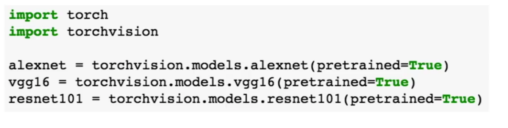

# software

There are lots of different frameworks. Best ones are pytorch and tensorflow.

## WHy

Frameworks are good because:

1. Means you don't have to worry about terrifying computational graphs
2. Make it easier to compute gradients, automatic in fact

    Computing gradients is a ball-ache. 
    Most libraries try to look a lot like numpy plus convenience methods.

3. Make it run efficiently on a GPU without killing yourself

    guess what doesn't run on a GPU? That's right, numpy! Wanna compute some messy gradients in CUDA? Didn't think so. Libraries often let you just specify "and please run this on the GPU".

## Fun things

haha, turns out you can usually be like `optimizer.RMSPropGradientDescent(learningRate)` and it will automatically just optimize for you it for you, wile training everything that needs training and all that nonsense.

There are also generally super high level libraries that abstract everything heaps.

These libs often have pre-trained models.

And kind of GUIs like Kibana.

## Pytorch

Has these 3 main objects (can be thought as 3 levels of abstraction):

1. Tensor
    literally just a ndarray but runs operations on GPU

2. Variable
    node in a computational graph, stores data and gradient. Has exactly the same API as tensors.

3. Module
    represents a layer. Super high level.

To run things on GPU just cast everything to the `torch.cuda` datatype.

the `torch.nn` is a very high level framework. Use maybe.

`toch.optim` is used to help with things like optimizing the gradient descent. 

Often your whole model will just be an instance of a custom `torch.nn.module` class, with a `.forward` method that runs you once through the network.

### Data in pytorch

There's something called a `DataLoader`, which is a class that wraps a data set and helps you take minibatches and threading for efficiency and whatnot out of it.

### Pretrained models

IN like 3 lines you can grab a pre-trained model (it will auto download for you OMG).

### Visdom

Lets you visualize stuff

## Pytorch v Tensorflow

### static vs dynamic graphs

Tensorflow has 2 steps

1. build graph
2. keep running graph

pytorch builds a new graph on each iteration.

### dynamic advantages

You can actually write python code directly into the execution/running/building of your graph, rather than having to use weird syntax to bake it into the graph structure. Plus if you have control flow operations, aaaaaaal the different possible control flow states for the graph need to generated and saved before even running it once.

There is an idea of **modular networks**, where you have like 3 separate networks that can be used and you choose the best one for the current problem. This is easier to handle dynamically/in python code.

### static advantages

Static grapahing might be able to self-optimize, and hence have faster operations. Self optimization is costly though, so you couldn't do it every time you re-create a dynamic graph.

Static is kind of nice, because you might be able to serialize your graph and store it on disk and train it later.

