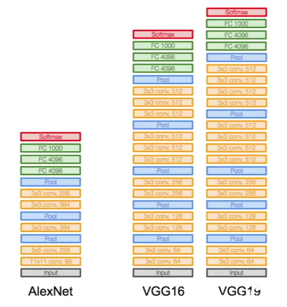
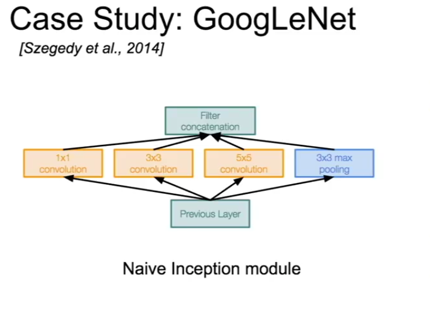
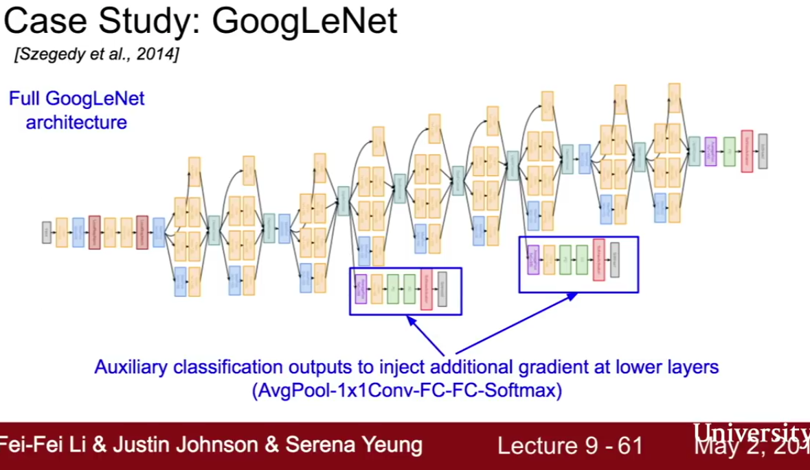
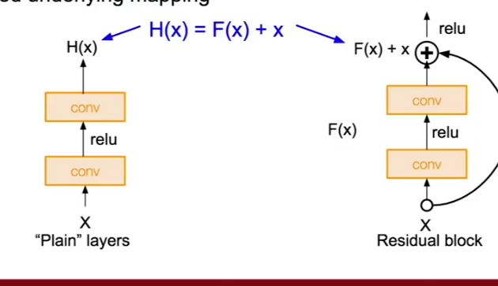
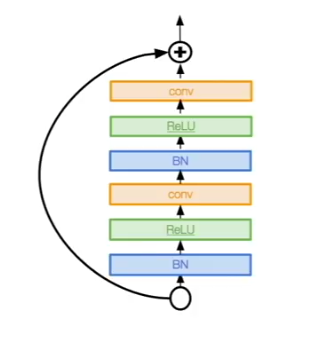

# Architecture Case Studies

## AlexNet

Has 5 conv layers, 2 fully connected layers before the final output. Uses normalization layers after conv layers.

Size of input: 227x227x3
Size after first layer (conv): 55x55x96
2nd layer (max pool): 27x27x96

...

2 fc layers 4096
finally one 1000 array of class scores

First use of ReLu.

A lot of data-augmentation.

Base learning rate reduced whenever a plateau is hit.

They also used a 7-CNN ensemble

Scored 16.4% error

8 layers in total.

## ZFNet

Basically just alexnet, but with better hyperparameters. 

Achived 11.7% error.

### Lesson:

Hyperparameters are important.

## VGG

7.3 error

16-19 layers

Very simple structure: convs then a pool and so on.

138 *MILLION* parameters. Overall has to store about 96MB in memory for each forward pass (i.e. for each image run through the network), so if you want to do 250 per epoch you need 2.5 GB RAM *JUST* for storage.

very small filters (3x3). Smaller filters mean:

1. less parameters
2. uses the idea of an **effective receptive field** to effectively scan larger area.

### Effective receptive field

I scan the first layer with 3x3, say the output is 28x28.

If I scan this 28x28 with another 3x3, each pixel I am scanning contains information of a 3x3 field on the first layer. Effectively im scanning 3x3x3x3 pixels, or 9x9 worth of information from the first layer.

Buuuut there's overlap, so actually we're only looking at a 5x5 area of the original image (i.e. one extra pixel around the edge).

It increases with each layer.

Fun fact: using these 3x3 layers  feeding into each other you can effectively scan a 7x7 field on the third layer, using far fewer parameters than single 7x7 layer would have.

They also did ensembling. 

Good for your own use for cross training.

## GoogleNet

22 layers

It's main thing was trying to make the network computationally efficient.

They used a thing called an **inception module**

They also removed all fully-connected layers (which saves parameters)

In fact they only had 5million parameters.

6.4 error

### Inception module

This is a diagram:

The idea is that you compute a bunch of different sizes of conv layers and a single pooling layer *in parallel*. So for instance, you have 128 1x1 filters, 192 3x3 filters 96 5x5 filters and a full-depth pooling layer all running at once. You end up with like 4 different large outputs (all the same dimensions length-and-width-wise because you zero pad untill they are all the same). You then concatonate these together depth-wise and boom, you have your like 28x28x672 or whatever output.

This is a lot. And you had to make 854 *Million* operations. Plus the pooling layer is an issue because it preserves the entire depth of the previous layer, so you are guarenteed to get deeper and deeper from inception module to inception module.

Looks too expensive.

### Soloution

They have a reduction layer that uses a 1x1 filter and reduces the depth of the previous layer (but with a linear function, so each param is kind of preserved). You put these before some of the conv layers and after the pooling layer.

You probably don't lose any information because you're like combining the previous layers, but no one is 100% sure why it works, it just kind of seems to.

Cuts the operations down to 458Million ops

*Note*: not all inception modules had these exact weights and sizes, this is just an example.

Here's what the whole network ended up looking like:

Those extra stacks sticking out the bottom are so we can compute the gradient halfway through the process, this gives is a better picture of how the parameters on the earlier layers are performing, and hence how we should update them. All the gradients end up being added up.

## Resnet

Fucking swept the floor.

literally 152 layers.

3.57% error (noice), and they won *everything* (better than human lol)

They used a thing called *resiudal connections*

### Question: what happens when you just have deeper and deeper layers?

Answer: They tend to do worse, with just plain conv layers stacked together.

You would also expect some over-fitting probably, right, because you have many more parameters, which together probably gear you towards something super specific.

*But* actually no. Turns out really deep networks don't perform any more worse at train time. The resNet people saw this and hatched a dastardly plot.

They also realized that you can make an exact replica of any shallow network with a deeper network if you just have the deeper layers be identity layers. So like, you should be able to approximate the performance of a shallow network with a deep network if the deep network somehow works out which layers to replace with identity layers.

Sooooo, the residual module was born:

The output of the residual thingo is the input, plus whatever the conv+relu construction spits out. The idea is that the network will learn when it's better to just have the identity function, and in those cases it will make the conv+relu value very very small.

Another way of putting it is: it is very hard (apparently, because deeper networks perform worse) to train a deep network to find exactly the correct weights to go directly from each input to a new output which is better. But, maybe it would be easier to train it to find something that just alters each input slightly into a slightly better version of itself. Maybe this would be easier to learn.

But remember, everyone is still just guessing.

Anyway, it seems to work, and in practice the best way seems to be to have 2 conv layers per residual thingo.

And make the layers deeper and deeper asa you go on.

Also bno fully connected layers. 

As the layers get deeper they use google's "bottleneck layers" which reduce the input depth. You reduce going into each residual block, so the next one doesn't get any deeper.

No dropout.

# And now some more networks that are good to know about

## NiN Network in network

Within each conv layer you put a whole network of neurons in/as your layer.

Came up with bottleneck layers

## Better resnets

A better version of resnet uses more layers:

Another better version claims that depth is not even important, it's just the residual bit. They used more filters per layer to make a shallower layer instead. With 50 layers they outperformed the original.
